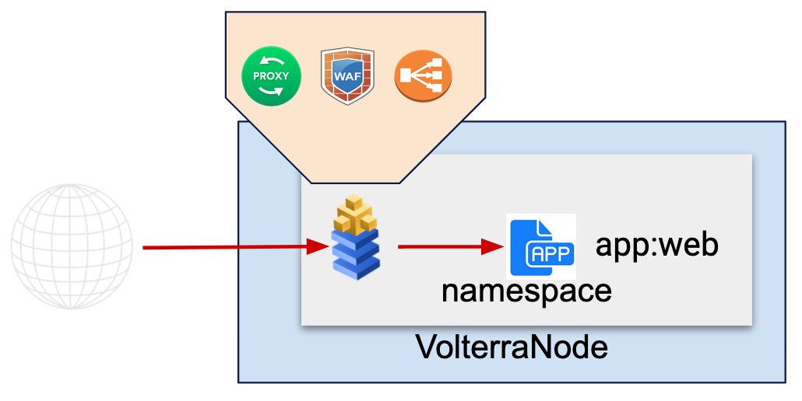
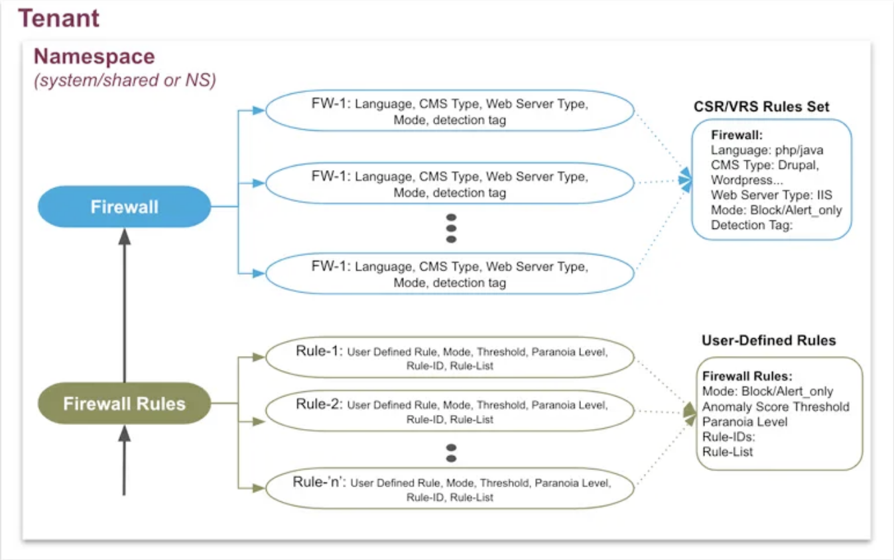

# WAF

WAFはHTTP Loadbalancer (virtual host) に設定します。
一度Proxyで終端したトラフィックをWAFで精査し、ロ-ドバランサー経由で実際のアプリケーションに通信します。

Firewall RuleでWAFの条件を作成し、Firewallでルールを設定します。HTTP Loadbalancerで作成したFirewallを適用します。

## WAFのルールの作成方法

WAFのルールは3つの作成方法があります

1. インテントベースのルール作成

    DOSやSQL injectionなど、攻撃内容などを選択

2. OWASPのルールセットからルール作成

    <https://owasp.org/www-chapter-japan/> で定められた攻撃をパラノイアレベルで設定

   パラノイアレベルについて <https://coreruleset.org/faq/>

3. 個別ルールを選択し、ルール作成

    必要なルールから個別にピックアップし、ルールを作成

## WAFのルールのコンフィグレーション

Firewall RuleでWAFのルールを設定します。

Firewall ruleを1つ作成します。

- owasp-level4
  - Mode: `BLOCK`
  - Anomaly Score Threshold:`1`
  - Paranoia Level: `4`
  - Rule List Type: `Exclude`

作成したWAFルールをingress gatewayで作成したHTTP loadbalancerに適用します。
LoadbalancerのEditを開き、Security ConfigurationのShow Advanced Fieldsを有効にします。

- HTTP Loadbalancer
  - Select Web Application Firewall (WAF) Config: `Specify WAF Rules`
  - Specify WAF Rules: `security/owasp-level4`
