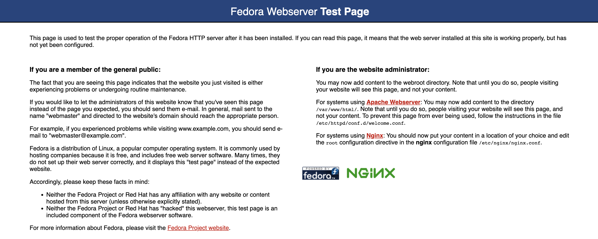

# Manage Kuberetes

これまでコンソールからvK8sを使ってPodなどを作成しましたが、通常のKuberetes clusterのようにローカルのAPIを使って、vK8sでは開放されていないAPIの利用も可能です。
DCSではこの機能を[Managed K8s(Physical K8s)](https://docs.cloud.f5.com/docs/how-to/app-management/create-deploy-managed-k8s)と呼んでいます。

Manage k8sを動作させるにはAppStack SiteでK8s clusterのテンプレートを作成し、CEをプロビジョニングする必要があります。
テンプレートはMasterやWorkerノード、IPアドレスなどのインターフェイスの設定、外部ストレージ、GPUの有無、Kubevirtの有効可などがあります。

また、AppStack SiteはKuberentesの複数のManifestを定義し、組み合わせることで、同じK8sのManifestを複数サイトに簡単に適用、更新ができます。

例えばPod Security Policyを作成し、そのManifestを3つのAppStack siteに適用することができます。
Pod Security Policyを変更すると、その変更は3つのAppStack site(K8s cluster)に自動的に適用されます。


## AppStack siteの作成

Manage k8sを利用するためにAppStack siteを作成します。

1. Cluster Roleの作成 (Option)
1. Cluster Role Bindingの作成
1. Pod Security Policyの作成 (Option)
1. K8s Clusterの作成
1. AppStack siteの作成
1. CEのプロビジョニング

### Cluster Roleの作成

Home -> Cloud and Edge Sites -> Manage -> Manage K8s -> K8s Cluster Roles で “Add K8s K8s Cluster Role”を選択します。

Cluster roleはUIもしくはYamlで設定することが可能です。(Yamlの場合、Show Advanced Fieldsの有効可が必要です。)
プリセットのCluster roleを利用することも可能ですが、`ves-io-admin-cluster-role` はすべてのロールが有効可されており、`ves-io-psp-permissive`は以下のような設定が入っているだけなので、商用利用では適切なRoleを設定することが推奨されます。

```
apiVersion: rbac.authorization.k8s.io/v1
kind: ClusterRole
metadata:
  creationTimestamp: null
  name: ves-io-psp-permissive
rules:
- apiGroups:
  - extensions
  resources:
  - podsecuritypolicies
  verbs:
  - use
```

ここでは以下のYamlでを設定しています。

```
apiVersion: rbac.authorization.k8s.io/v1
kind: ClusterRole
metadata:
  name: secret-reader
rules:
- apiGroups: [""]
  resources: ["secrets"]
  verbs: ["get", "watch", "list"]
```


### Cluster Role Bindingの作成

Home -> Cloud and Edge Sites -> Manage -> Manage K8s -> K8s Cluster Role Bindings で “Add K8s K8s Cluster Role Binding”を選択します。

プリセットでは以下のコンフィグが設定されています。これはプリセットのClusterRoleの`ves-io-psp-permissive`のみなので、新規にClusterRoleBindingを作成し、Postなどを許可するClusterRoleを設定する必要があります。

ここではプリセットのCluster role `ves-io-admin-cluster-role`をClusterRoleBinding`admin-crb`としてアクセスできるユーザーを設定し、オブジェクトを作成します。

- name: `admin-crb`
- K8s Cluster Role : `shared/ves-io-admin-cluster-role`
- Subject
  - Select Subject: `User`
    - User: `DCS user name`


### Pod Security Policyの作成

Home -> Cloud and Edge Sites -> Manage -> Manage K8s -> K8s Pod Security Policies で “Add K8s Pod Security Policy”を選択します。

PSPはUIもしくはYamlで設定することが可能です。(Yamlの場合、Show Advanced Fieldsの有効可が必要です。)
PSPの設定はオプションですが、デフォルトの設定の場合 `Privileged true`が有効であったり、`root`でPodを作成することが可能なので、商用利用では適切なPSPを設定することが推奨されます。


UIでは`Name`と1つ以上のPSPオブジェクトの設定が必須です。設定が必要な項目をUIで設定してください。
既存のPSPのYAMLがある場合はYAMLを直接設定することができます。この場合、`Name`とYAML内の `metadata.name`を同じ値にしてください。

ここでは以下のYamlでを設定しています。

```
apiVersion: policy/v1beta1
kind: PodSecurityPolicy
metadata:
  name: not-allow-priv
spec:
  privileged: false
  seLinux:
    rule: RunAsAny
  supplementalGroups:
    rule: RunAsAny
  runAsUser:
    rule: RunAsAny
  fsGroup:
    rule: RunAsAny
  volumes:
    - "*"
```


### K8s Clusterの作成

作成したClusterRole,ClusterRoleBindingなどをK8s clusterでテンプレートとして適用します。

Home -> Cloud and Edge Sites -> Manage -> Manage K8s -> K8s Clusters で “Add K8s K8s Cluster”を選択します。

- name: `mk8s-cluster1`
- Site Local Access: `Enable Site Local API Access`
  - Local Domain: `mk8s.localnet` #ここで設定したドメイン名は`Site名+ Local Domain名`としてKubeconfig内のserverにセットされます。
  - Port for K8s API Server: `Default k8s Port`
- VoltConsole Access: `Enable VoltConsole API Access` これを有効にすると、Console経由でローカルAPIにアクセスできます。ただし、Consoleアクセスができる適切なユーザー権限が必要です。
- POD Security Policies：`Default Pod Security Policy`
- K8s Cluster Roles: `Custom K8s Cluster Roles`
  - List of Cluster Role List: `shared/ves-io-admin-cluster-role`
- K8s Cluster Role Bindings: `K8s Cluster Role Bindings`
  - List of Cluster Role Binding List: `system/admin-crb`


### AppStack siteの作成

AppStack siteはSiteのテンプレートを事前に作成し、AppStackと同じ名前のSiteがRegistrationされると、CEにテンプレートがダウンロードされプロビジョニングされます。

ここではMulti nodeクラスタの設定やインターフェイスのBondingなども設定できますが、この例ではシンプルに1ノードクラスタでの設定を行います。

Home -> Cloud and Edge Sites -> Manage -> Site Management
 -> App Stack Sites で “Add App Stack Site”を選択します。

- name: `mk8s-cluster1`
- Generic Server Certified Hardware: `vmware-voltstack-combo` (使用する環境に合わせてください)
- List of Master Nodes: `master-0`
- Latitude: `緯度`
- Longitude: `経度`
- Advanced Configuration: `Show Advanced Fields`を有効
  - Site Local K8s API access: `Enable Site Local K8s API access`
    - Enable Site Local K8s API access: `system/mk8s-cluster1`
  - Enable/Disable VMs support: `VMs support Enabled` #有効にするとKubevirtが利用できます。

作成すると Site Admin Stateが`Waiting for Registration`の状態となります。


### CEのプロビジョニング

通常と同じようにCEの初期設定をいれ、AppStack siteと同じ名前でRegistrationします。


プロビジョニングが終わると Home -> Cloud and Edge Sites -> Managed k8s -> Overview にクラスタが表示され、Podなどのリソースが確認できるようになります。


## Local APIを利用したK8sオペレーション

Local APIを利用して通常のK8s clusterと同様のオペレーションが可能です。
Kubectlを使いManifestを利用してPodやServiceを作成できます。

作成したオブジェクトはManaged K8s Overviewから確認でき、Podのリソース使用率なども確認できます。
また、vk8sでは利用できないCRDなども設定できます。

接続用のKubeconfigは該当のSiteのActionsから取得できます。
Local KubeconfigはSiteに直接接続するために必要です。Global KubeconfigはConsole経由で該当サイトのKubenetes APIに接続します。


mk8sでは通常のKubernetesと同じようにローカルAPIを使用します。このため、Kubeconfig内のServerのFQDNの名前解決が必要です。

例えば`server: https://mk8s-cluster1.mk8s.localnet:65443` と記載されていた場合、DNSか/etc/hostsに適切なレコードを設定してください。

``` bash
cat /etc/hosts
127.0.0.1   localhost localhost.localdomain localhost4 localhost4.localdomain4
::1         localhost localhost.localdomain localhost6 localhost6.localdomain6
192.168.201.2 mk8s-cluster1.mk8s.localnet
```

実際にKubectlを使って接続できます。

```
kubectl --kubeconfig ves_system_mk8s-cluster1_kubeconfig_local.yaml get node
NAME       STATUS   ROLES        AGE   VERSION
master-0   Ready    ves-master   25h   v1.21.7-ves
```

### mk8sのPod/Service作成とIngress Gateway

以下のようにNginxをKubectlを使って作成します。

```
apiVersion: apps/v1
kind: Deployment
metadata:
  name: my-nginx
spec:
  selector:
    matchLabels:
      run: my-nginx
  replicas: 2
  template:
    metadata:
      labels:
        run: my-nginx
    spec:
      containers:
      - name: my-nginx
        image: nginx
        ports:
        - containerPort: 80
---
apiVersion: v1
kind: Service
metadata:
  name: my-nginx
  labels:
    run: my-nginx
spec:
  ports:
  - port: 80
    protocol: TCP
  selector:
    run: my-nginx
```

```
[lab@localhost ~]$ kubectl --kubeconfig ves_system_mk8s-cluster1_kubeconfig_local.yaml create namespace my-nginx
namespace/my-nginx created

[lab@localhost ~]$ kubectl --kubeconfig ves_system_mk8s-cluster1_kubeconfig_local.yaml apply -f mk8s-sample.yaml -n my-nginx
deployment.apps/my-nginx created
service/my-nginx created
[lab@localhost ~]$ kubectl --kubeconfig ves_system_mk8s-cluster1_kubeconfig_local.yaml get po -n my-nginx
NAME                        READY   STATUS    RESTARTS   AGE
my-nginx-5b56ccd65f-4npvc   2/2     Running   0          24s
my-nginx-5b56ccd65f-t7jpj   2/2     Running   0          24s
[lab@localhost ~]$ kubectl --kubeconfig ves_system_mk8s-cluster1_kubeconfig_local.yaml get svc -n my-nginx
NAME         TYPE        CLUSTER-IP      EXTERNAL-IP   PORT(S)   AGE
kubernetes   ClusterIP   100.127.192.1   <none>        443/TCP   25h
my-nginx     ClusterIP   100.127.193.0   <none>        80/TCP    26s
```

ここで作成したものはUIからも確認できます。


ここで作成したServiceもDCSのLoad balancerで公開することができます。
設定方法はvk8sと同様です。ただし、Console上にmk8sのNamespaceが存在しない場合、同一Namespaceを作成し、そのNamespace内にOrigin poolやHTTP Loadbalancerの設定を行ってください。

### mk8sのVM作成とIngress Gateway

以下のようにCirrosのテスト用VMを立ち上げます。通常のPodを上げるようにManifestをapplyするとVMがPodとして立ち上がります。ServiceもContainerと変わらず設定できます。

```
apiVersion: kubevirt.io/v1
kind: VirtualMachine
metadata:
  name: testvm
spec:
  running: true
  template:
    metadata:
      labels:
        kubevirt.io/size: small
        kubevirt.io/domain: testvm
        run: testvm
    spec:
      domain:
        devices:
          disks:
            - name: containerdisk
              disk:
                bus: virtio
            - name: cloudinitdisk
              disk:
                bus: virtio
          interfaces:
          - name: default
            masquerade: {}
        resources:
          requests:
            memory: 64M
      networks:
      - name: default
        pod: {}
      volumes:
        - name: containerdisk
          containerDisk:
            image: quay.io/kubevirt/cirros-container-disk-demo
        - name: cloudinitdisk
          cloudInitNoCloud:
            userDataBase64: SGkuXG4=
---
apiVersion: v1
kind: Service
metadata:
  name: testvm
spec:
  ports:
  - port: 22
    protocol: TCP
    targetPort: 22
    name: ssh
  - port: 80
    protocol: TCP
    targetPort: 80
    name: http
  selector:
    run: testvm
```

以下のようにVMが`Running`になっており、PodとしてVMが動作しているのが確認できます。

```
[lab@localhost ~]$ kubectl --kubeconfig ves_system_mk8s-cluster1_kubeconfig_local.yaml get vm -n my-nginx
NAME     AGE   STATUS    VOLUME
testvm   24m   Running
[lab@localhost ~]$ kubectl --kubeconfig ves_system_mk8s-cluster1_kubeconfig_local.yaml get pod -n my-nginx
NAME                         READY   STATUS    RESTARTS   AGE
my-nginx-5b56ccd65f-llwds    2/2     Running   0          88m
my-nginx-5b56ccd65f-zssbr    2/2     Running   0          88m
virt-launcher-testvm-jxm92   3/3     Running   0          24m
```

PodへのアクセスはContainerと同様にUIのコンソールなどからアクセスできます。


### VMの操作と外部からのVM接続

KubevirtのプラグインをKubectlに導入することでコンテナと同じようにVMの操作が可能です。
プラグインの管理には[Krew](https://krew.sigs.k8s.io/docs/user-guide/setup/install/)というOSSが便利です。

Krewを導入したあと、Kubevirtプラグインを導入します。以下のコマンドでプラグインのインストールが可能です。

```
kubectl krew install virt
```

コマンドを発行できれば完了です。

```
 kubectl virt
Available Commands:
  addvolume         add a volume to a running VM
  completion        generate the autocompletion script for the specified shell
  console           Connect to a console of a virtual machine instance.
  expose            Expose a virtual machine instance, virtual machine, or virtual machine instance replica set as a new service.
  fslist            Return full list of filesystems available on the guest machine.
  guestfs           Start a shell into the libguestfs pod
  guestosinfo       Return guest agent info about operating system.
  help              Help about any command
  image-upload      Upload a VM image to a DataVolume/PersistentVolumeClaim.
  migrate           Migrate a virtual machine.
  migrate-cancel    Cancel migration of a virtual machine.
  pause             Pause a virtual machine
  permitted-devices List the permitted devices for vmis.
  port-forward      Forward local ports to a virtualmachine or virtualmachineinstance.
  removevolume      remove a volume from a running VM
  restart           Restart a virtual machine.
  soft-reboot       Soft reboot a virtual machine instance
  ssh               Open a SSH connection to a virtual machine instance.
  start             Start a virtual machine.
  stop              Stop a virtual machine.
  unpause           Unpause a virtual machine
  usbredir          Redirect a usb device to a virtual machine instance.
  userlist          Return full list of logged in users on the guest machine.
  version           Print the client and server version information.
  vnc               Open a vnc connection to a virtual machine instance.

Use "kubectl virt <command> --help" for more information about a given command.
Use "kubectl virt options" for a list of global command-line options (applies to all commands).
```

Fedoraのイメージを使用し、VM内でNginxをたちあげ外部からの接続を行ったり、VMへのSSH接続を行います。

以下のYamlを使用し、VMと対応するサービスを作成します。サービスでは22番(SSH)と80番(HTTP)を設定しています。
ユーザーは `fedora` パスワードは `fedora`です。

```
apiVersion: kubevirt.io/v1alpha3
kind: VirtualMachine
metadata:
  name: testvm
spec:
  running: false
  template:
    metadata:
      labels:
        kubevirt.io/size: small
        kubevirt.io/domain: testvm
    spec:
      domain:
        devices:
          disks:
            - name: containerdisk
              disk:
                bus: virtio
            - name: cloudinitdisk
              disk:
                bus: virtio
          interfaces:
          - name: default
            bridge: {}
        resources:
          requests:
            memory: 4096M
      networks:
      - name: default
        pod: {}
      volumes:
        - name: containerdisk
          containerDisk:
            image: kubevirt/fedora-cloud-container-disk-demo
        - name: cloudinitdisk
          cloudInitNoCloud:
            userData: |-
              #cloud-config
              password: fedora
              chpasswd: { expire: False }
---
apiVersion: v1
kind: Service
metadata:
  annotations:
  name: testvm
  namespace: my-nginx
spec:
  ports:
  - name: ssh
    port: 22
    protocol: TCP
    targetPort: 22
  - name: http
    port: 80
    protocol: TCP
    targetPort: 80
  selector:
    kubevirt.io/domain: testvm
  sessionAffinity: None
  type: ClusterIP
```

yamlをkubectl applyするとVMが作成されます。

```
kubectl --kubeconfig ves_system_mk8s-cluster1_kubeconfig_local.yaml -n my-nginx apply -f kubevirt-nginx.yaml
virtualmachine.kubevirt.io/testvm created
service/testvm created

kubectl --kubeconfig ves_system_mk8s-cluster1_kubeconfig_local.yaml -n my-nginx get vm
NAME     AGE   STATUS    VOLUME
testvm   7s    Stopped
```

作成したVMをスタートします。

```
kubectl virt start testvm --kubeconfig ves_system_mk8s-cluster1_kubeconfig_local.yaml -n my-nginx

VM testvm was scheduled to start
```

STATUSがRunningにかわりVMが起動します。起動するまでしばらく待ちます。

```
kubectl --kubeconfig ves_system_mk8s-cluster1_kubeconfig_local.yaml -n my-nginx get vm
NAME     AGE   STATUS    VOLUME
testvm   40m   Running


kubectl virt console testvm --kubeconfig ves_system_mk8s-cluster1_kubeconfig_local.yaml -n my-nginx
 36K
[    1.815348] smpboot: CPU0: AMD EPYC Processor (family: 0x17, model: 0x1, stepping: 0x2)
[    1.820348] Performance Events: PMU not available due to virtualization, using software events only.
[    1.824499] rcu: Hierarchical SRCU implementation.
[    1.837348] NMI watchdog: Perf NMI watchdog permanently disabled
[    1.838735] smp: Bringing up secondary CPUs ...
[    1.839277] smp: Brought up 1 node, 1 CPU
[    1.839428] smpboot: Max logical packages: 1
[    1.839930] smpboot: Total of 1 processors activated (4788.72 BogoMIPS)
[    1.864966] devtmpfs: initialized
[    1.871393] x86/mm: Memory block size: 128MB
```

ユーザーとパスワードを入力してログインします。ここからは通常のVM同じです。

```
testvm login: fedora
Password:

[fedora@testvm ~]$
[fedora@testvm ~]$
```

Nginxをインストールし起動します。

```
sudo dnf install -y nginx
sudo nginx
```

VM上に立ち上げたNginxに外部からのアクセスを許可します。Manage k8s内で作成したNamespaceがConsoleに作成されていない場合、先にNamespaceを作成してください。
Containerと同じようにOrigin poolを作成します。

Nginxをインターネット上に公開する設定を行います。

Home -> Loab Balancers -> Origin Pools でVMが作成されているNamespaceを選択します。

- Name: `kubevirt-nginx`
- Origin Servers
  - Select Type of Origin Server: `k8s Service Name of Origin Server on given Sites.`
  - Service Name: `testvm.namespace`を入力します。 (`kubernetes service名.namespace`のフォーマット）
  - Select Site or Virtual Site: `Site` -> `mk8s site名`
  - Select Network on the Site: `vk8s Networks on Site`
- Port: `80`


Home -> HTTP Load Balancers で “Add HTTP load balancer”を選択します。

- Name: `kubevirt-nginx`
- Domains: `dummy.domain-name` (設定するとDNS infoにDCSからdomain名が払い出されます。設定後に払い出されたドメイン名を設定してください。)
- Select Type of Load Balancer: `HTTP`
- Default Origin servers: `namespace/kubevirt-nginx` (上記で作成したOrigin pool)

ブラウザなどでドメインにアクセスするとテストページが表示されます。



次にVMに対してローカルからSSHできるように設定します。

Home -> Loab Balancers -> Origin Pools でVMが作成されているNamespaceを選択します。

- Name: `kubevirt-ssh`
- Origin Servers
  - Select Type of Origin Server: `k8s Service Name of Origin Server on given Sites.`
  - Service Name: `testvm.namespace`を入力します。 (`kubernetes service名.namespace`のフォーマット）
  - Select Site or Virtual Site: `Site` -> `mk8s site名`
  - Select Network on the Site: `vk8s Networks on Site`
- Port: `22`

Home -> TCP Load Balancers で “Add TCP load balancer”を選択します。

- Name: `kubevirt-ssh`
- Listen Port: `10022` # VMにSSH接続するためのポート番号
- Default Origin Pools: `namespace/kubevirt-ssh` (上記で作成したOrigin pool)
- VIP Configuration: `Show Advanced Fields`を有効にし、`Advertise Custom`を指定
- Edit Configure
  - List of Sites to Advertise
    - Select Where to Advertise: `site`
    - Site Network: `Inside and Outside Network`
    - Virtual Site Reference: `managed k8sのサイト名`

Manage k8sのSiteのIPアドレスにsshするとVMにリダイレクトされます。

```
ssh fedora@192.168.201.3 -p 10022
The authenticity of host '[192.168.201.3]:10022 ([192.168.201.3]:10022)' can't be established.
ECDSA key fingerprint is SHA256:Sdsh+ybdYjPQk/YxAIiuWdeNVMOp42kMIu/bNwp4obM.
ECDSA key fingerprint is MD5:61:a1:4a:7f:4e:f5:8c:d5:05:3f:18:bf:ec:af:bb:cc.
Are you sure you want to continue connecting (yes/no)? yes
Warning: Permanently added '[192.168.201.3]:10022' (ECDSA) to the list of known hosts.
fedora@192.168.201.3's password:
Last login: Tue Apr 19 00:39:14 2022
[fedora@testvm ~]$
[fedora@testvm ~]$
```