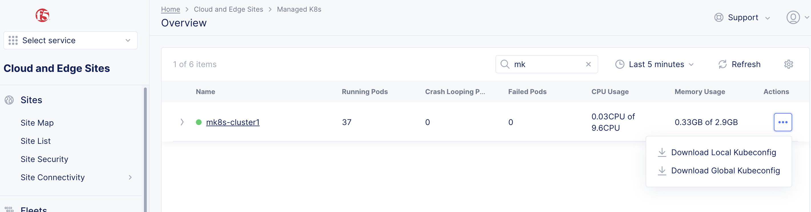

# Manage Kuberetes

これまでコンソールからvK8sを使ってPodなどを作成しましたが、通常のKuberetes clusterのようにローカルのAPIを使って、vK8sでは開放されていないAPIの利用も可能です。
DCSではこの機能を[Managed K8s(Physical K8s)](https://docs.cloud.f5.com/docs/how-to/app-management/create-deploy-managed-k8s)と呼んでいます。

Manage k8sを動作させるにはAppStack SiteでK8s clusterのテンプレートを作成し、CEをプロビジョニングする必要があります。
テンプレートはMasterやWorkerノード、IPアドレスなどのインターフェイスの設定、外部ストレージ、GPUの有無、Kubevirtの有効可などがあります。

また、AppStack SiteはKuberentesの複数のManifestを定義し、組み合わせることで、同じK8sのManifestを複数サイトに簡単に適用、更新ができます。

例えばPod Security Policyを作成し、そのManifestを3つのAppStack siteに適用することができます。
Pod Security Policyを変更すると、その変更は3つのAppStack site(K8s cluster)に自動的に適用されます。


## AppStack siteの作成

Manage k8sを利用するためにAppStack siteを作成します。

1. Cluster Roleの作成 (Option)
1. Cluster Role Bindingの作成
1. Pod Security Policyの作成 (Option)
1. K8s Clusterの作成
1. AppStack siteの作成
1. CEのプロビジョニング

### Cluster Roleの作成

Home -> Cloud and Edge Sites -> Manage -> Manage K8s -> K8s Cluster Roles で “Add K8s K8s Cluster Role”を選択します。

Cluster roleはUIもしくはYamlで設定することが可能です。(Yamlの場合、Show Advanced Fieldsの有効可が必要です。)
プリセットのCluster roleを利用することも可能ですが、`ves-io-admin-cluster-role` はすべてのロールが有効可されており、`ves-io-psp-permissive`は以下のような設定が入っているだけなので、商用利用では適切なRoleを設定することが推奨されます。

```
apiVersion: rbac.authorization.k8s.io/v1
kind: ClusterRole
metadata:
  creationTimestamp: null
  name: ves-io-psp-permissive
rules:
- apiGroups:
  - extensions
  resources:
  - podsecuritypolicies
  verbs:
  - use
```

ここでは以下のYamlでを設定しています。

```
apiVersion: rbac.authorization.k8s.io/v1
kind: ClusterRole
metadata:
  name: secret-reader
rules:
- apiGroups: [""]
  resources: ["secrets"]
  verbs: ["get", "watch", "list"]
```


### Cluster Role Bindingの作成

Home -> Cloud and Edge Sites -> Manage -> Manage K8s -> K8s Cluster Role Bindings で “Add K8s K8s Cluster Role Binding”を選択します。

プリセットでは以下のコンフィグが設定されています。これはプリセットのClusterRoleの`ves-io-psp-permissive`のみなので、新規にClusterRoleBindingを作成し、Postなどを許可するClusterRoleを設定する必要があります。

ここではプリセットのCluster role `ves-io-admin-cluster-role`をClusterRoleBinding`admin-crb`としてアクセスできるユーザーを設定し、オブジェクトを作成します。

- name: `admin-crb`
- K8s Cluster Role : `shared/ves-io-admin-cluster-role`
- Subject
  - Select Subject: `User`
    - User: `DCS user name`


### Pod Security Policyの作成

Home -> Cloud and Edge Sites -> Manage -> Manage K8s -> K8s Pod Security Policies で “Add K8s Pod Security Policy”を選択します。

PSPはUIもしくはYamlで設定することが可能です。(Yamlの場合、Show Advanced Fieldsの有効可が必要です。)
PSPの設定はオプションですが、デフォルトの設定の場合 `Privileged true`が有効であったり、`root`でPodを作成することが可能なので、商用利用では適切なPSPを設定することが推奨されます。


UIでは`Name`と1つ以上のPSPオブジェクトの設定が必須です。設定が必要な項目をUIで設定してください。
既存のPSPのYAMLがある場合はYAMLを直接設定することができます。この場合、`Name`とYAML内の `metadata.name`を同じ値にしてください。

ここでは以下のYamlでを設定しています。

```
apiVersion: policy/v1beta1
kind: PodSecurityPolicy
metadata:
  name: not-allow-priv
spec:
  privileged: false
  seLinux:
    rule: RunAsAny
  supplementalGroups:
    rule: RunAsAny
  runAsUser:
    rule: RunAsAny
  fsGroup:
    rule: RunAsAny
  volumes:
    - "*"
```


### K8s Clusterの作成

作成したClusterRole,ClusterRoleBindingなどをK8s clusterでテンプレートとして適用します。

Home -> Cloud and Edge Sites -> Manage -> Manage K8s -> K8s Clusters で “Add K8s K8s Cluster”を選択します。

- name: `mk8s-cluster1`
- Site Local Access: `Enable Site Local API Access`
  - Local Domain: `mk8s.localnet` #ここで設定したドメイン名は`Site名+ Local Domain名`としてKubeconfig内のserverにセットされます。
  - Port for K8s API Server: `Default k8s Port`
- VoltConsole Access: `Enable VoltConsole API Access` これを有効にすると、Console経由でローカルAPIにアクセスできます。ただし、Consoleアクセスができる適切なユーザー権限が必要です。
- POD Security Policies：`Default Pod Security Policy`
- K8s Cluster Roles: `Custom K8s Cluster Roles`
  - List of Cluster Role List: `shared/ves-io-admin-cluster-role`
- K8s Cluster Role Bindings: `K8s Cluster Role Bindings`
  - List of Cluster Role Binding List: `system/admin-crb`


### AppStack siteの作成

AppStack siteはSiteのテンプレートを事前に作成し、AppStackと同じ名前のSiteがRegistrationされると、CEにテンプレートがダウンロードされプロビジョニングされます。

ここではMulti nodeクラスタの設定やインターフェイスのBondingなども設定できますが、この例ではシンプルに1ノードクラスタでの設定を行います。

Home -> Cloud and Edge Sites -> Manage -> Site Management
 -> App Stack Sites で “Add App Stack Site”を選択します。

- name: `mk8s-cluster1`
- Generic Server Certified Hardware: `vmware-voltstack-combo` (使用する環境に合わせてください)
- List of Master Nodes: `master-0`
- Latitude: `緯度`
- Longitude: `経度`
- Advanced Configuration: `Show Advanced Fields`を有効
  - Site Local K8s API access: `Enable Site Local K8s API access`
    - Enable Site Local K8s API access: `system/mk8s-cluster1`
  - Enable/Disable VMs support: `VMs support Enabled` #有効にするとKubevirtが利用できます。

作成すると Site Admin Stateが`Waiting for Registration`の状態となります。


### CEのプロビジョニング

通常と同じようにCEの初期設定をいれ、AppStack siteと同じ名前でRegistrationします。


プロビジョニングが終わると Home -> Cloud and Edge Sites -> Managed k8s -> Overview にクラスタが表示され、Podなどのリソースが確認できるようになります。


## Local APIを利用したK8sオペレーション

Local APIを利用して通常のK8s clusterと同様のオペレーションが可能です。
Kubectlを使いManifestを利用してPodやServiceを作成できます。

作成したオブジェクトはManaged K8s Overviewから確認でき、Podのリソース使用率なども確認できます。
また、vk8sでは利用できないCRDなども設定できます。

接続用のKubeconfigは該当のSiteのActionsから取得できます。
Local KubeconfigはSiteに直接接続するために必要です。Global KubeconfigはConsole経由で該当サイトのKubenetes APIに接続します。



mk8sでは通常のKubernetesと同じようにローカルAPIを使用します。このため、Kubeconfig内のServerのFQDNの名前解決が必要です。

例えば`server: https://mk8s-cluster1.mk8s.localnet:65443` と記載されていた場合、DNSか/etc/hostsに適切なレコードを設定してください。

``` bash
cat /etc/hosts
127.0.0.1   localhost localhost.localdomain localhost4 localhost4.localdomain4
::1         localhost localhost.localdomain localhost6 localhost6.localdomain6
192.168.201.2 mk8s-cluster1.mk8s.localnet
```

実際にKubectlを使って接続できます。

```
kubectl --kubeconfig ves_system_mk8s-cluster1_kubeconfig_local.yaml get node
NAME       STATUS   ROLES        AGE   VERSION
master-0   Ready    ves-master   25h   v1.21.7-ves
```

### mk8sのPod/Service作成とIngress Gateway

以下のようにNginxをKubectlを使って作成します。

```
apiVersion: apps/v1
kind: Deployment
metadata:
  name: my-nginx
spec:
  selector:
    matchLabels:
      run: my-nginx
  replicas: 2
  template:
    metadata:
      labels:
        run: my-nginx
    spec:
      containers:
      - name: my-nginx
        image: nginx
        ports:
        - containerPort: 80
---
apiVersion: v1
kind: Service
metadata:
  name: my-nginx
  labels:
    run: my-nginx
spec:
  ports:
  - port: 80
    protocol: TCP
  selector:
    run: my-nginx
```

```
[lab@localhost ~]$ kubectl --kubeconfig ves_system_mk8s-cluster1_kubeconfig_local.yaml create namespace my-nginx
namespace/my-nginx created

[lab@localhost ~]$ kubectl --kubeconfig ves_system_mk8s-cluster1_kubeconfig_local.yaml apply -f mk8s-sample.yaml -n my-nginx
deployment.apps/my-nginx created
service/my-nginx created
[lab@localhost ~]$ kubectl --kubeconfig ves_system_mk8s-cluster1_kubeconfig_local.yaml get po -n my-nginx
NAME                        READY   STATUS    RESTARTS   AGE
my-nginx-5b56ccd65f-4npvc   2/2     Running   0          24s
my-nginx-5b56ccd65f-t7jpj   2/2     Running   0          24s
[lab@localhost ~]$ kubectl --kubeconfig ves_system_mk8s-cluster1_kubeconfig_local.yaml get svc -n my-nginx
NAME         TYPE        CLUSTER-IP      EXTERNAL-IP   PORT(S)   AGE
kubernetes   ClusterIP   100.127.192.1   <none>        443/TCP   25h
my-nginx     ClusterIP   100.127.193.0   <none>        80/TCP    26s
```

ここで作成したものはUIからも確認できます。


ここで作成したServiceもDCSのLoad balancerで公開することができます。
設定方法はvk8sと同様です。ただし、Console上にmk8sのNamespaceが存在しない場合、同一Namespaceを作成し、そのNamespace内にOrigin poolやHTTP Loadbalancerの設定を行ってください。

### mk8sのVM作成とIngress Gateway

以下のようにCirrosのテスト用VMを立ち上げます。通常のPodを上げるようにManifestをapplyするとVMがPodとして立ち上がります。ServiceもContainerと変わらず設定できます。

```
apiVersion: kubevirt.io/v1
kind: VirtualMachine
metadata:
  name: testvm
spec:
  running: true
  template:
    metadata:
      labels:
        kubevirt.io/size: small
        kubevirt.io/domain: testvm
        run: testvm
    spec:
      domain:
        devices:
          disks:
            - name: containerdisk
              disk:
                bus: virtio
            - name: cloudinitdisk
              disk:
                bus: virtio
          interfaces:
          - name: default
            masquerade: {}
        resources:
          requests:
            memory: 64M
      networks:
      - name: default
        pod: {}
      volumes:
        - name: containerdisk
          containerDisk:
            image: quay.io/kubevirt/cirros-container-disk-demo
        - name: cloudinitdisk
          cloudInitNoCloud:
            userDataBase64: SGkuXG4=
---
apiVersion: v1
kind: Service
metadata:
  name: testvm
spec:
  ports:
  - port: 22
    protocol: TCP
    targetPort: 22
    name: ssh
  - port: 80
    protocol: TCP
    targetPort: 80
    name: http
  selector:
    run: testvm
```

以下のようにVMが`Running`になっており、PodとしてVMが動作しているのが確認できます。

```
[lab@localhost ~]$ kubectl --kubeconfig ves_system_mk8s-cluster1_kubeconfig_local.yaml get vm -n my-nginx
NAME     AGE   STATUS    VOLUME
testvm   24m   Running
[lab@localhost ~]$ kubectl --kubeconfig ves_system_mk8s-cluster1_kubeconfig_local.yaml get pod -n my-nginx
NAME                         READY   STATUS    RESTARTS   AGE
my-nginx-5b56ccd65f-llwds    2/2     Running   0          88m
my-nginx-5b56ccd65f-zssbr    2/2     Running   0          88m
virt-launcher-testvm-jxm92   3/3     Running   0          24m
```

PodへのアクセスはContainerと同様にUIのコンソールなどからアクセスできます。

