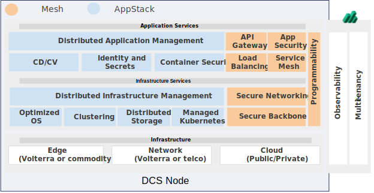
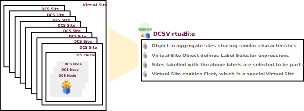

# DCSの基礎知識

DCSはSaaSサービスとして提供しており、マネージドKubernetesのAppStack、統合セキュリティサービスのMesh、コントローラーのConsoleで構成されます。AppStack、MeshはDCS Node上で動作し、それぞれの機能だけを利用することも可能です。
DCS Nodeはクラウド、x86ハードウェア、仮想マシン上で動作します。

- Mesh
DCSのグローバルネットワークインフラストラクチャと分散型アプリケーションゲートウェイで、クラウドやエッジでアプリケーションをセキュアに接続し、監視基盤を提供。
  - Routing (BGP)
  - L3-L4 Firewall
  - Load balancer
  - GSLB

- AppStack
マルチクラウドやエッジにまたがるアプリケーションや異種インフラストラクチャを展開、セキュア、運用するための分散型アプリケーション管理プラットフォームです。

## SiteとVirtual-site

DCSではSiteとしてDCS Nodeクラスタを管理し、Virtual Siteは複数のSiteをグループ化したものです。Virtual SiteはSiteに設定されたラベルを元にグループ化され、アプリケーション配信やセキュリティポリシーなどを設定すると、対象のグループ全体に情報が伝搬します。

例えば4つのSite(Kuberentes cluster)があった場合、Virtual siteとして`minami-kanto`を作成します。
このVirtual siteに対してKubernetes Manifestやセキュリティポリシーを設定すると、Virtual site内のすべてのSiteに設定が配布されます。
このとき一部のSiteがダウンしている場合、該当のSiteが復旧後に最新のコンフィグが自動的に適用されます。ユーザーはコンフィグの再設定などは必要はありません。

Kubernetesオブジェクトの場合、AnnotationとしてDCS上で作成したVirtual site名を入れるだけで対応できるため、既存Manifestを大きくなおす必要はありません。

## Origin poolとLoad Balancer

異なるDCS Nodeクラスタの通信を行う場合、Origin PoolとLoad Balancerの設定を行います
Origin Poolは送信先のサービスやIPアドレスをエンドポイントとして設定します。複数の宛先がある場合、Origin PoolはEndpointのロードバランスを行います。
Load Balancerは送信元のDCS NodeやLoad Balancer の設定をします。Load BalancerはAppStack上のアプリケーションがリモートサイトと通信する場合や、ユーザーサイト内の端末がリモートサイトにアクセスする場合にも利用できます。Origin Poolが複数ある場合、Load BalancerはGSLBとして動作します。

