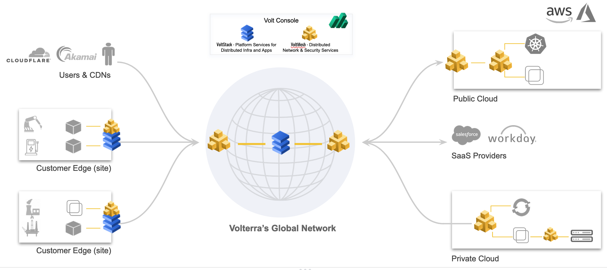
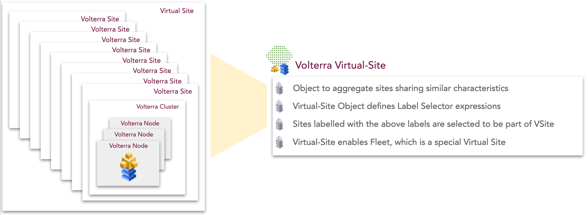
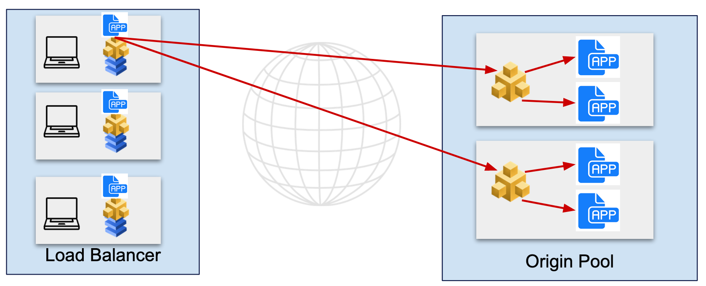

# Volterraの基礎知識

VolterraはSaaSサービスとして提供しており、マネージドKubernetesのVoltStack、統合セキュリティサービスのVoltMesh、コントローラーのVoltConsoleで構成されます。VoltStack、VoltMeshはVolterraNode上で動作し、それぞれの機能だけを利用することも可能です。
VoltrerraNodeはクラウド、x86ハードウェア、仮想マシン上で動作します。

- VoltMesh
Volterraのグローバルネットワークインフラストラクチャと分散型アプリケーションゲートウェイで、クラウドやエッジでアプリケーションをセキュアに接続し、監視基盤を提供。

- VoltStack
マルチクラウドやエッジにまたがるアプリケーションや異種インフラストラクチャを展開、セキュア、運用するための分散型アプリケーション管理プラットフォーム

## SiteとVirtual-site

VolterraではSiteとしてVolterra Nodeクラスタを管理し、Virtual Siteは複数のSiteをグループ化したものです。Virtual SiteはSiteに設定されたラベルを元にグループ化され、アプリケーション配信やセキュリティポリシーなどを設定すると、対象のグループ全体に情報が伝搬します。

## Origin poolとLoad Balancer

異なるVolterra Nodeクラスタの通信を行う場合、Origin PoolとLoad Balancerの設定を行います
Origin Poolは送信先のサービスやIPアドレスをエンドポイントとして設定します。複数の宛先がある場合、Origin PoolはEndpointのロードバランスを行います。
Load Balancerは送信元のVolterra NodeやLoad Balancer の設定をします。Load BalancerはVoltStack上のアプリケーションがリモートサイトと通信する場合や、ユーザーサイト内の端末がリモートサイトにアクセスする場合にも利用できます。Origin Poolが複数ある場合、Load BalancerはGSLBとして動作します。

