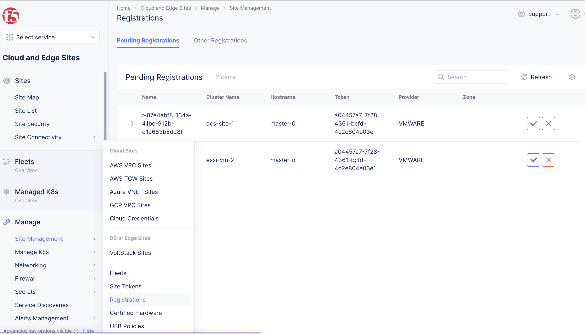
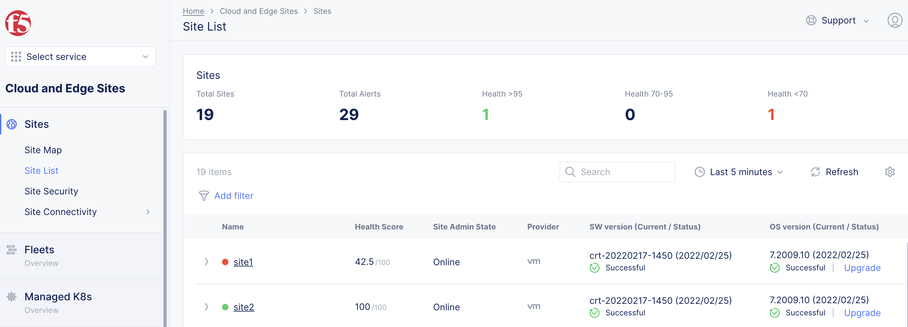
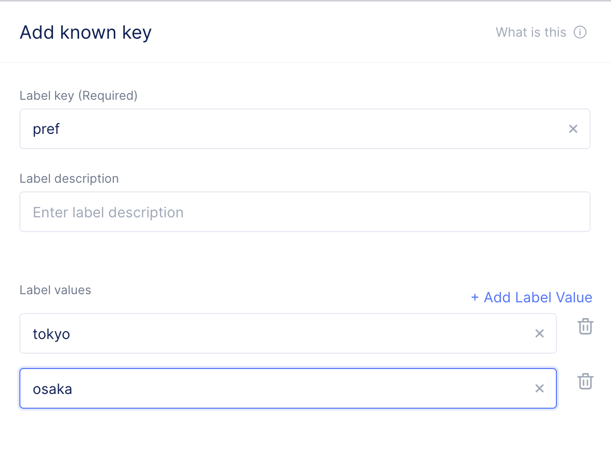

# Volterraノードのインストールと登録

## Volterraノードのインストール

VolterraNodeは以下のような様々な場所へのインストールが可能です。

1. ESXiへのインストール
2. KVMへのインストール
3. ハードウェアへのインストール
4. AWSへのインストール
5. Azureへのインストール

イメージはリンクから取得が可能です。<https://www.volterra.io/docs/releases/voltnode>

### ESXiへのインストール

OVAファイルからVolterra Nodeをインストールします。
少なくとも1ポートはNAT経由でのインターネットに接続できるポートが必要です。
デフォルトではシングルNICなため、複数必要な場合はOVAファイルのインストール後にNICを追加してください。

インストールの詳細はリンクを参照のこと。<https://www.volterra.io/docs/installation/installing-volterra-node/vmware>


### KVMへのインストール

ISOファイルからからVolterra Nodeをインストールします。
マルチNICが必要な場合はVirt-Managerなどで2NIC指定してください。
少なくとも1ポートはNAT経由でのインターネットに接続できるポートが必要です。
また、KVMではHuge pageの設定が必要です。
インストールの詳細はリンクを参照のこと <https://www.volterra.io/docs/installation/installing-volterra-node/kvm>

インストール時に、NICのDevice Modelは`virtio`を設定してください。
また、CPUは4vCPU以上、メモリは8GB以上を割り当ててください。


virshで実行する場合は以下のように実行してください。

```virt-install --name vm1 --ram 8192 --vcpus 4 --disk path=/home/lab/kvm/vm1.qcow2,format=qcow2,size=20 --network bridge=bridge1,model=virtio   --cdrom /home/lab/vsb-ves-ce-certifiedhw-generic-production-centos-7.2003.14-202006271045.1593259578.iso --noreboot --autostart --graphics vnc,listen=0.0.0.0,port=6951 --cpu host-passthrough```

### ハードウェアへのインストール

ISOファイルからからVolterra Nodeをインストールします。確認済みのハードウェアはIntel NUCなどです。
新しすぎるハードウェアはLinuxで対応ドライバがない場合があり正常に動作しません。
また、NICなどによっても正常に動作しない場合があります。

現在確認が取れているハードウェアはWebサイトで確認してください。
<https://www.volterra.io/docs/installation/installing-volterra-node/hardware>

HPEやDellのハードウェアの場合、インターフェイス名がem1やp1p1,eno1で表示される場合があります。
Volterraイメージではeth0/eth1のみ扱えるため、dellやHPEのイメージが登録されるまで使用することができません。

ダウンロードしたISOはUSBなどにコピーし、ブータブルディスクとしてNUCなどからブートしてください。


### AWSへのインストール

### Azureへのインストール

## Tokenの設定

VolterraNodeの設定にはTokeが必要です。
VoltConsoleのSystem Namespace > Site Management > Site TokensからTokenを発行してください。
“Name” を入力し、”Add Site Token”をクリックし、Tokenを作成します。


## Volterra Nodeの初期設定(CLI)

### tokenなどの設定

Volterra NodeにコンソールもしくはSSHで接続します。user/password = admin/Volterra123
初期パスワードはログイン後に必ず変更が必要です。ログイン後、`Configure`を設定します。(Static IPが必要な場合は先に次ページの設定が必要です）

1. TokenはVoltConsoleで設定したTokenを入力します。
2. Site NameはVolterra NodeのSite(クラスタ)名を入力します。あとで変更が可能です。
3. hostnameはオプションです。master-0が設定されます
4. Latitude/Longtitude（緯度経度）は有効な数値を入力します。あとで変更が可能です。
5. Certified hardwareはイメージによって異なりますが、シングルNICの場合はxxx-voltstack-combo　マルチNICの場合はxxx-multi-nic-voltstack-comboを選択してください。


### インターフェイスの設定

Static IPアドレスが必要な場合は “configura-network”でNICの設定を行います。
Single NICの場合は OUTSIDE、Multi NICの場合はINSIDEにもチェック(スペースで選択)を行います

SiteLocal = OUTSIDE
SiteLocalInside = INSIDE　となります。

SiteLocalInside GW,DNS2 addressはオプションのため、空欄も可能です。

WifiをOUTSIDEとして使用することも可能です。その場合はSSIDやPSKの設定を行います


## Volterra Nodeの初期設定(WebUI)

VolterraNodeにブラウザで接続します。`https://node-ip:65500` user/password = admin/Volterra123
初期パスワードはログイン後に必ず変更が必要です。ログイン後、`Configure`を設定します。(Static IPが必要な場合は先に次ページの設定が必要です）


### Tokenなどの設定

TokenはVoltConsoleで設定したTokenを入力します。
Site NameはVolterra NodeのSite(クラスタ)名を入力します。あとで変更が可能です。
hostnameはmaster-0を入力します。
Latitude/Longtitude（緯度経度）は有効な数値を入力します。あとで変更が可能です。


Certified hardwareはイメージによって異なりますが、xxx-voltstack-comboもしくはxxx-multi-nic-voltstack-comboを選択してください。

### Volterra Nodeの登録

初期設定を行い、インターネットに接続するとVoltConsoleのSystem NamespaceにSiteとしてVolterra Nodeが表示されます。
サイトを選択し、Regionを”tokyo”を選択しAcceptするとVolterra Nodeのセットアップが始まります。

Multi Master nodeの場合、`cluster size`は`3`を選択します。
このとき、`Cluster name`は3ノードとも同じ名前を設定し、Volterra Nodeの初期設定時のHostnameは `master-0`,`master-1`,`master-2`と3ノードともユニークなホスト名を入力してください。
**回線速度などにもよりますが、20分程度かかります。




Sites -> Site Listに作成したVolterra Nodeが表示されます。SW versionが “Successful”になると、プロビジョニングが終了しており、暫く経つと、Health Scoreが100になります。



### Labelの作成

Volterra Nodeやpodなどに設定するLabelは`shared label`または個別での手動設定が可能です。shared labelはshared namespaceより作成します。
shared namespaceで作成したLabelはすべてのNamespaceで利用が可能です。

共通で使用すべきラベルなどを設定する場合に利用します。例えば `site-setting` というKeyを作成し、 `kvm`や`esxi`などのValueを持つLabelを作成し、SiteにLabelを設定します。

Manage -> Labels > Known Keys から `Add known key` でshared Labelsを作成できます。




## Labelの設定

作成したラベルをVolterra Nodeに設定します。system namespaceの Sites -> Site list より、Volterra NodeのEditより作成したラベルを追加します。


