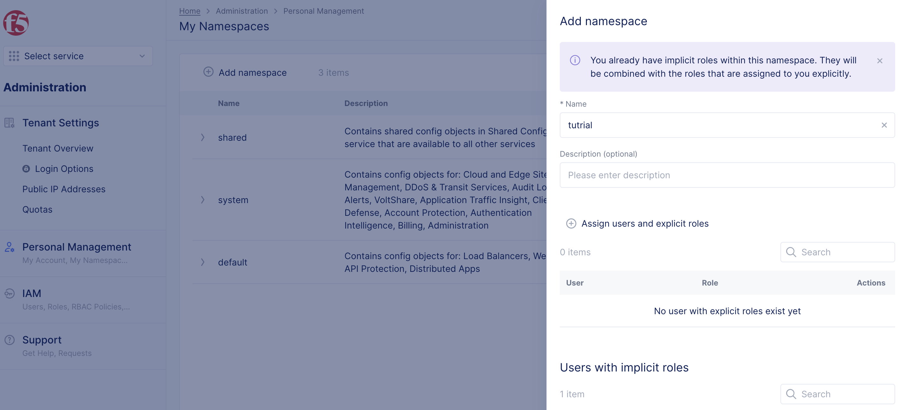
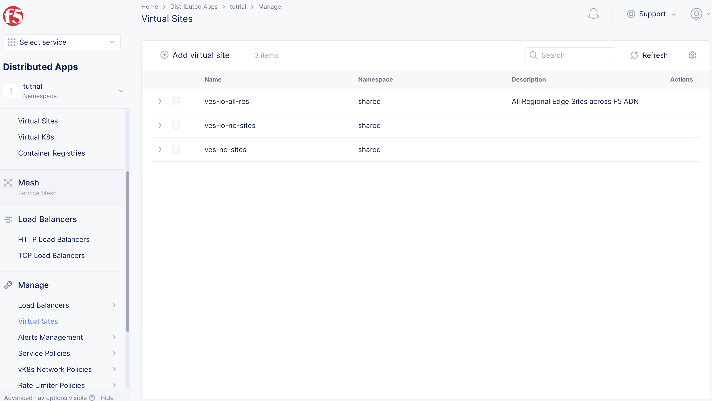
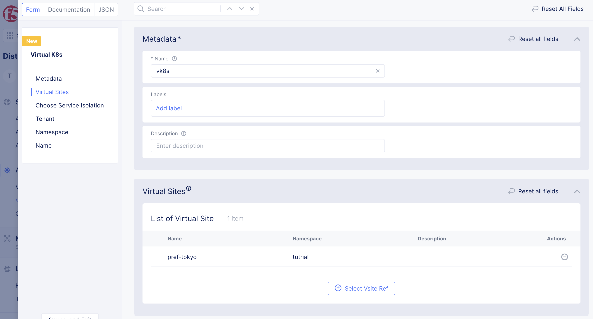

# Virtual Kubernetesの設定

Virtual KubernetesはVolterra独自の概念です。Volterraでは複数のKubernetes Clusterを1つの仮想的なKubernetesとして扱います。
このため、Virtua Kubernetesには複数のVirtual Siteを設定することができ、1つのKubernetes manifestを複数のKubernetes clusterに配布することが可能です。


## ユーザーNamespaceの作成

Virtual KubernetesはユーザーNamepsaceに作成するため、Namespaceを作成します。
Generalの`My Namespaces`から、 `Add namespace`を開き、Namapace名を入れてSaveします。
作成したNamespaceを選択すると、ユーザーNamaspaceに入れます。




## Virtual Siteの作成

作成したNamespaceに移動し、Manage -> Virtual host ->Virtual sitesより `Add Virtual site`を選択します。
nameに virtual-site名、Site TypeはCEを選択し、Site Selector ExpressionではSiteに設定したラベルを選択します。 Continueを選択するとVirtual siteが作成されます。
例) Name: trial-vsite, Site Type: CE, Selector Expression: site-setting:kvm



## Virtual kubernetesの作成

Applications -> Virtual k8sより`Add Virtual K8s`を選択します。Nameを入力し、Select vsite refから作成したVirtual Siteを選択します。 Add Virtual k8sをクリックするとVirtual kubernetesが作成されます。
*作成まで数十秒かかります。




## deplyomentの作成

作成したVirtual K8sを選択するとKuberneresの作成画面が表示されます。通常のKubernetes Manifestと同様にDeploymentやServiceを作成すると、実際のSiteにワークロードが作成されます。

下のようにDeploymentを設定すると、該当するSiteにコンテナが立ち上がります。

```apiVersion: apps/v1
kind: Deployment
metadata:
  name: nginx-deployment
  namespace: trial
spec:
  selector:
    matchLabels:
      app: nginx
  replicas: 1
  template:
    metadata:
      labels:
        app: nginx
    spec:
      containers:
      - name: nginx
        image: nginx:1.14.2
        ports:
        - containerPort: 80
```


