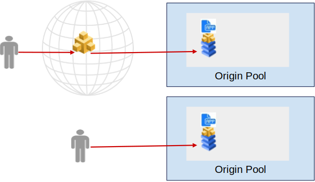

# Ingress Gatewayの設定

Kubernetes Serviceはそのままでは外部からアクセスできないため、作成したAppStack上のアプリケーションに外部から接続できるようにIngress Gatewayを設定します。Internet上のMeshを利用しても良いですし、ローカルのDCS Nodeの利用も可能です。

Ingress GatewayはHTTP/TCP loadbalancerとして動作します。Loadlabancerの宛先はOrigin Poolとして、定義します。



## Origin poolの作成

Virtual Kubernetesの設定で作成したNginxを外部からアクセスできるようにIngress Gatewayを設定します。作成したNginx ServiceをOrigin poolとして登録します。 Manage -> Loab Balancers -> Origin Pools で `Add Origin Pool`を選択します。

以下の設定をします

- Name: `nginx-endpoint`
- Origin Servers
  - Select Type of Origin Server: `k8s Service Name of Origin Server on given Sites.`
  - Service Name: `nginx.namespace`を入力します。 (`kubernetes service名.namespace`のフォーマット）
  - Select Site or Virtual Site: `Virtual Site` -> `namespace/pref-tokyo`
  - Select Network on the Site: `Vk8s Networks on Site`
- Port: `80`


## インターネットからの接続

### HTTP load balancerの設定

Home -> Load Balancers -> HTTP Load Balancers で “Add HTTP load balancer”を選択します。

- Name: `nginx-lb`
- Domains: `dummy.domain-name` (設定するとDNS infoにDCSからdomain名が払い出されます。設定後に払い出されたドメイン名を設定してください。)
- Select Type of Load Balancer: `HTTP`
- Default Origin servers: `namespace/nginx-endpoint` (上記で作成したOrigin pool)

設定するとDNS infoにDCSからdomain名が払い出されます。作成したロードバランサーのDomainsに設定するか、任意のDNSサーバのCNAMEレコードに設定してください。
外部から設定したドメインにアクセスするとNginxのWebUIが表示されます。


ブラウザにドメインを入力すると表示されます。


>DNSの伝搬やコンフィグの反映に1-2分かかる場合があります。

## Local Interfaceからのアクセス

### HTTP Loadbalancerの設定

Manage -> HTTP Load Balancers で “Add HTTP load balancer”を選択します。

- Name: `nginx-lb`
- Domains: `nginx.domain-name`
- Select Type of Load Balancer: `HTTP`
- Default Origin Pools: `namespace/nginx-endpoint` (上記で作成したOrigin pool)
- VIP Configuration: `Show Advanced Fields`を有効にし、`Advertise Custom`を指定
- Edit Configure
  - List of Sites to Advertise
    - Select Where to Advertise: `virtual-site`
    - Site Network: `Inside and Outside Network`
    - Virtual Site Reference: `namespace/pref-tokyo`


ローカルDNSがない場合は/etc/hostsに設定したドメイン名とエッジノードのIPアドレスを入力するか、Curlで -H “Host: domain name”で確認します。

```
curl http://192.168.2.197 -H "Host: localhost.com"
<!DOCTYPE html>
<html>
<head>
<title>Welcome to nginx!</title>
<style>
    body {
        width: 35em;
        margin: 0 auto;
        font-family: Tahoma, Verdana, Arial, sans-serif;
    }
</style>
</head>
<body>
<h1>Welcome to nginx!</h1>
<p>If you see this page, the nginx web server is successfully installed and
working. Further configuration is required.</p>

<p>For online documentation and support please refer to
<a href="http://nginx.org/">nginx.org</a>.<br/>
Commercial support is available at
<a href="http://nginx.com/">nginx.com</a>.</p>

<p><em>Thank you for using nginx.</em></p>
</body>
</html>
```

** Virtual Siteで`pref-osaka`を作成し、Virtual Site Referenceに`pref-osaka`を設定すると、pref-osakaのDCS NodeのIPアドレスにアクセスすると、Site1 - Site2の間にトンネルを動的にはり、pref-tokyoのアプリにアクセスできるようになります。


## トラブルシューティング

Nginxにアクセスできない場合、同一Virtual-siteにUbuntuなどのコンテナを立ち上げ、Service経由でNginxにアクセスできるか確認してください。

Service経由でアクセスできる場合、Origin Poolが正常に稼働しているか確認してください。
Origin poolの`Show Child Object`内のGlobal Satusが空欄の場合は、設定のService nameが間違っていたり、Virtual-siteが異なるサイトを指定している可能性があります。コンフィグに問題がない場合はサポートにケースオープンしてください。
* 時間がかかる場合があるので、その場合はLoad balancerの設定後に再度確認してください。

よくあるトラブル
- Kubernetes ServiceのSelectorラベルが間違っており、PodとServiceが紐付いていない
- Origin poolのServiceの指定が間違っている。 (namespaceが間違っているなど)
- Virtual site / Siteが間違っている
- Load balancer でOrigin poolの指定が間違っている


