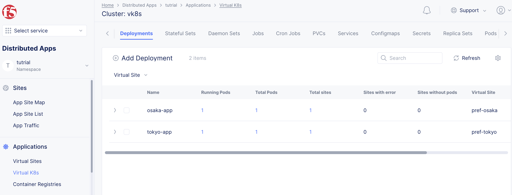
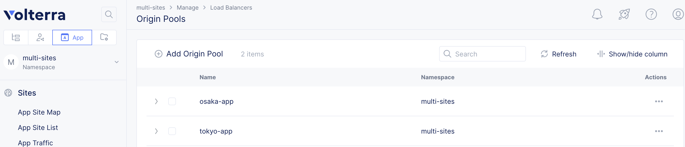
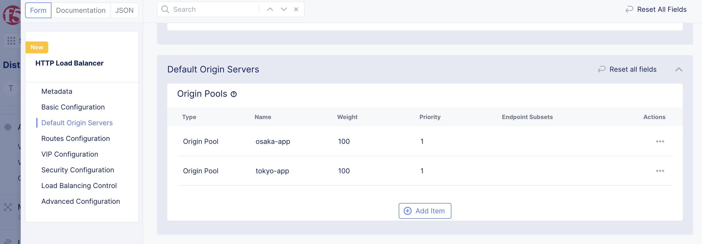

# 複数virtual-siteの使い方

Namespaceには複数のVirtual-siteを設定できます。例えば pref-tokyoやpref-osakaを作成し、実際のSiteが複数Virtual-site内に存在します。
Vk8sを作成すると、所属させるVirtual-siteを選択できます。
図にすると以下のような階層型構造になります。


DeploymentやServiceなどのManifestを作成すると、Vk8s内の全てのVirtual siteに反映されます。特定のVirtual-siteだけにManifestを反映させてい場合はAnnotation `ves.io/sites`を使用します。

例えば、virtual-site: pref-tokyoとpref-osakaの2つがありpref-tokyoのみに反映させる場合、Annotationは

```metadata:
  annotations:
    ves.io/virtual-sites: namespace/pref-tokyo
```

となります。

複数指定する場合は

```metadata:
  annotations:
    ves.io/virtual-sites: namespace/pref-tokyo,namespace/pref-osaka
```

となります。

## 複数virtual siteをもつワークロードの作成

namespace:`multi-sites`を作成し、vk8sに2つの以下の2つのVirutal siteを設定します。
Name: `pref-tokyo`
Site type: `CE`
Site Selecter Expression: `pref:tokyo`

Name: `pref-osaka`
Site type: `CE`
Site Selecter Expression: `pref:osaka`

- Freeユーザーの場合は既存のNamespaceを先に削除してから作成してください。


vk8sに2つのVirtual-site `pref-tokyo`と`pref-osaka`に、Deploymentを作成します。

pref-tokyo

```kind: Deployment
apiVersion: apps/v1
metadata:
  name: tokyo-app
  annotations:
    ves.io/virtual-sites: multi-sites/pref-tokyo
spec:
  replicas: 1
  selector:
    matchLabels:
      app: tokyo-app
  template:
    metadata:
      labels:
        app: tokyo-app
    spec:
      containers:
        - name: tokyo-app
          image: dnakajima/inbound-app:1.0
          ports:
            - containerPort: 8080
```

pref-osaka

```kind: Deployment
apiVersion: apps/v1
metadata:
  name: osaka-app
  annotations:
    ves.io/virtual-sites: multi-sites/pref-osaka
spec:
  replicas: 1
  selector:
    matchLabels:
      app: osaka-app
  template:
    metadata:
      labels:
        app: osaka-app
    spec:
      containers:
        - name: osaka-app
          image: dnakajima/inbound-app:1.0
          ports:
            - containerPort: 8080
```

それぞれのVirtual siteにDeploymentが作成されます。



vk8sに2つのVirtual-site `pref-tokyo`と`pref-osaka`に、Serviceを作成します

pref-tokyo

```apiVersion: v1
kind: Service
metadata:
  name: tokyo-app
  labels:
    app: tokyo-app
  annotations:
    ves.io/virtual-sites: multi-sites/pref-tokyo
spec:
  ports:
  - port: 8080
    targetport: 8080
    protocol: TCP
  selector:
    app: tokyo-app
```

pref-osaka

```apiVersion: v1
kind: Service
metadata:
  name: osaka-app
  labels:
    app: osaka-app
  annotations:
    ves.io/virtual-sites: multi-sites/pref-osaka
spec:
  ports:
  - port: 8080
    targetport: 8080
    protocol: TCP
  selector:
    app: osaka-app
```

## Ingress Gatewayの設定

作成した2つのサービスをロードバランスして公開します。


### Origin poolの作成

作成したワークロードをそれぞれ`tokyo-app`と`osaka-app`としてOrigin-poolに登録します。

- Name: `tokyo-app`
  - Select Type of Origin Server: `k8sService Name of Origin Ser...`
  - Service Name: `tokyo-app.multi-sites`を入力します。 (`kubernetes service名.namespace`のフォーマット）
  - Select Site or Virtual Site: `Virtual Site` -> `multi-sites/pref-tokyo`
  - Select Network on the Site: `Vk8s Networks on Site`
  - Port: `8080`

- Name: `osaka-app`
  - Select Type of Origin Server: `k8sService Name of Origin Ser...`
  - Service Name: `osaka-app.multi-sites`を入力します。 (`kubernetes service名.namespace`のフォーマット）
  - Select Site or Virtual Site: `Virtual Site` -> `multi-sites/pref-osaka`
  - Select Network on the Site: `Vk8s Networks on Site`
  - Port: `8080`




### HTTP loadbalancerの作成

Manage -> HTTP Load Balancers で “Add HTTP load balancer”を選択します。

- Name: multi-vsite-lb
- Domains: dummy.localhost (設定するとDNS infoにVolterraからdomain名が払い出されます。設定後に払い出されたドメイン名を設定してください。)
- Select Type of Load Balancer: `HTTP`
- Default Origin Pools: 2つのOrigin poolを設定します。
Weightは100,100にしていますが、比率を変えることで、ローバランスレシオを調節できます。




Curlなどで確認すると、tokyo-app, osaka-appでロードバランスされることが確認できます。

```curl http://ves-io-3b89b61f-b82b-4140-915a-96f56818fd56.ac.vh.ves.io/
<html>
<body>
This pod is running on tokyo-app-767948955-jpbnx
</body>
</html>

curl http://ves-io-3b89b61f-b82b-4140-915a-96f56818fd56.ac.vh.ves.io/
<html>
<body>
This pod is running on osaka-app-7cc7958f77-2x4br
</body>
</html>
```
