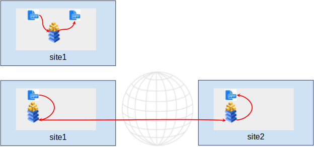
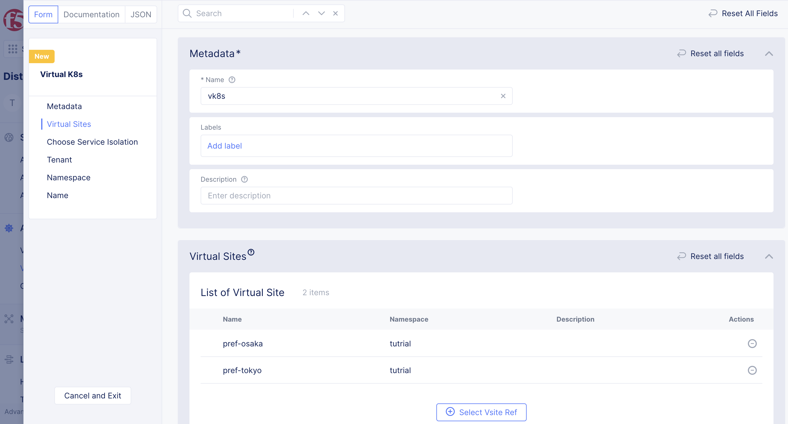
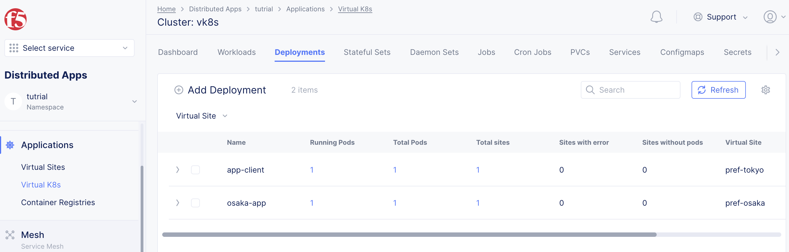
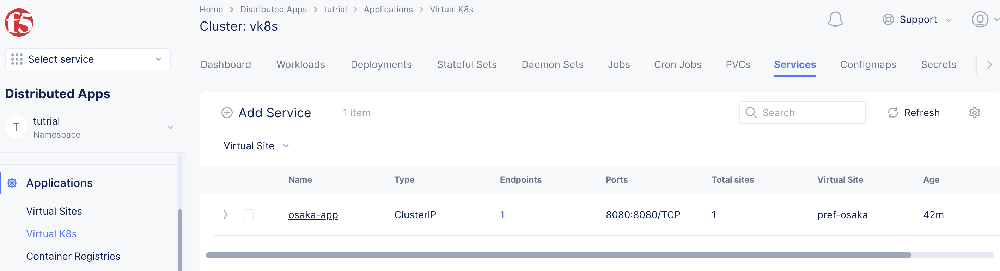
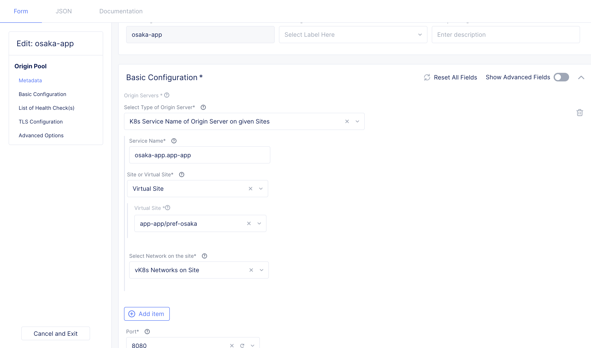
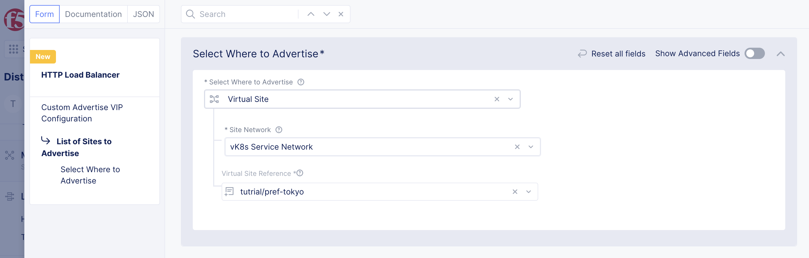
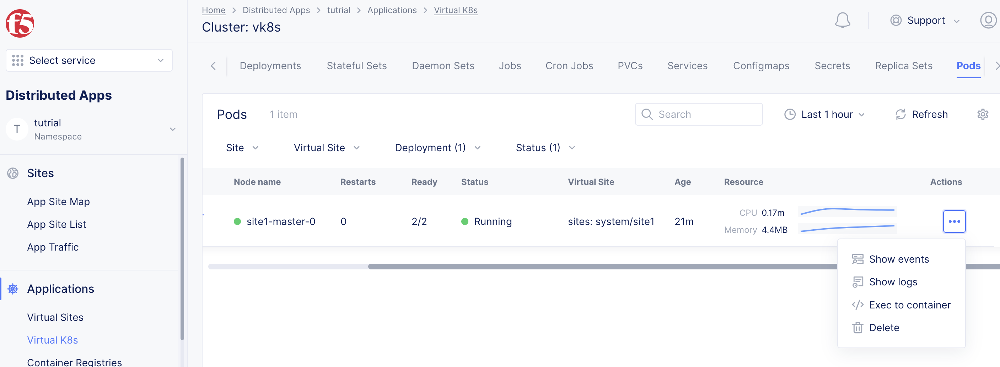
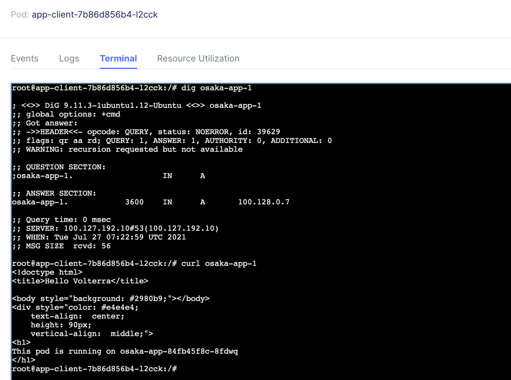

# App to App接続

同一Site内では通常のKubernetesと同様にPodはService経由で他のPodにアクセスできます。
異なるSiteのServiceにアクセスする場合はHTTP/TCP Loadbalancerの設定が必要です。



## vk8s manifest の作成

namespace:`app-app`を作成し、vk8sに以下の2つのVirutal siteを設定します。

Name: `pref-tokyo`
Site type: `CE`
Site Selecter Expression: `pref:tokyo`

Name: `pref-osaka`
Site type: `CE`
Site Selecter Expression: `pref:osaka`

- Freeユーザーの場合は既存のNamespaceを先に削除してから作成してください。



vk8sに2つのVirtual-site `pref-tokyo`と`pref-osaka`に、Deploymentを作成します。

pref-tokyo

```
apiVersion: apps/v1
kind: Deployment
metadata:
  name: app-client
  annotations:
    ves.io/virtual-sites: app-app/pref-tokyo
spec:
  replicas: 1
  selector:
    matchLabels:
      app: app-client
  template:
    metadata:
      labels:
        app: app-client
    spec:
      containers:
        - name: app-client
          image: dnakajima/netutils:1.3
```

pref-osaka

```
apiVersion: apps/v1
kind: Deployment
metadata:
  name: osaka-app
  annotations:
    ves.io/virtual-sites: app-app/pref-osaka
spec:
  replicas: 1
  selector:
    matchLabels:
      app: osaka-app
  template:
    metadata:
      labels:
        app: osaka-app
    spec:
      containers:
        - name: osaka-app
          image: dnakajima/inbound-app:1.0
          ports:
            - containerPort: 8080
```

それぞれのVirtual siteにDeploymentが作成されます



vk8sにVirtual-site:`pref-osaka`にserviceを作成します

```
apiVersion: v1
kind: Service
metadata:
  name: osaka-app
  labels:
    app: osaka-app
  annotations:
    ves.io/virtual-sites: app-app/pref-osaka
spec:
  ports:
  - port: 8080
    targetport: 8080
    protocol: TCP
  selector:
    app: osaka-app
```



## Ingress gatewayの作成

### origin poolの作成

作成したosaka-appワークロードをOrigin-poolに登録します。

- Name: `osaka-app`
- Origin Servers
  - Select Type of Origin Server: `k8sService Name of Origin Server on given Sites`
  - Service Name: `osaka-app.multi-sites`を入力します。 (`kubernetes service名.namespace`のフォーマット）
  - Select Site or Virtual Site: `Virtual Site` -> `multi-sites/pref-osaka`
  - Select Network on the Site: `Vk8s Networks on Site`
  - Port: `8080`



### HTTP loadbalancerの作成

HTTP loadbalancerを作成し、Origin poolを設定します。
ここで設定したdomain名(osaka-app-1)はk8s上のpodに登録され、Podがリモートサービスに接続するのに使用します。

- Name: `osaka-app-lb`
- Domains: `osaka-app-1`
- Select Type of Load Balancer: `http`
- Default Origin Servers: `app-app/osaka-app`
- VIP Configuration: VIP Configuration を有効化し、`Advertise Custom` を選択しConfigureを選択
- Site Network: `vK8s Service Network`
- Virtual Site Reference: `app-app/pref-tokyo`
- Select Where to Advertise: `virtual-site`




### アクセス確認

podへのアクセスはvk8sのPodからコンテナのコンソールにアクセスできます。
app-clientの`Exec to Container`を選択します



tokyo-appを選択し、 bashを入力してConnectからコンソールに接続します。`dig osaka-app-1`や`curl osaka-app-1`を入力すると、接続用のIPアドレスや、実際のosaka-appへの接続が確認できます。



 