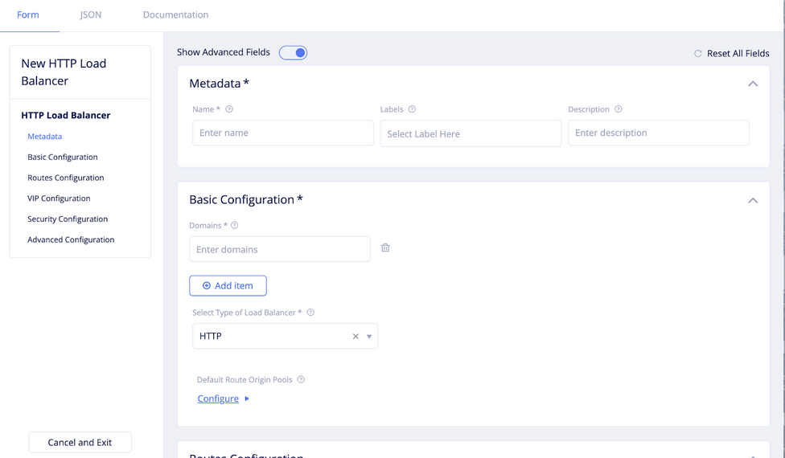
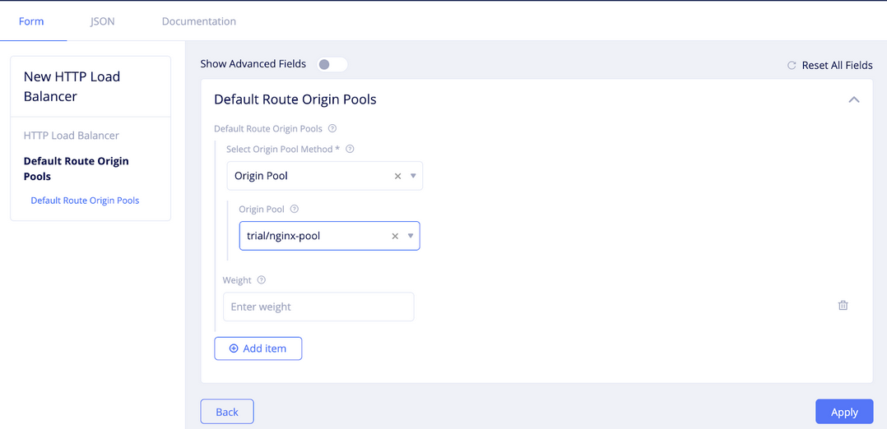

# Application Delivery Controller

VoltMesh単体で仮想マシンや既存Kubernetes ClusterにWAFやAPIゲートウェイの機能を提供します。Internet上のVoltMeshを利用しても良いですし、ローカルでの利用も可能です。
[4.Ingress Gateway](4_ingress_gateway.md)の設定と機能の差分はなく、Origin poolでのEndpointの指定のみが異なります。

ESXiやKVM上にNginxでWebSiteをたちあげ、VoltMeshのInsideインターフェイスからインターネット経由でサービスを公開します。
構成はOutsideのみのワンアームまたは、Outside/Insideのルーティングが可能です、
** ESXi にVolterra Nodeをインストールする際、OVAファイルで一度立ち上げたあと、NICを追加して MultiNIC構成にしてください。

## Origin poolの作成

namespaceは`seurity`とし、virtual-siteは`vsite-adc`を作成します。
VoltMesh経由で通信したいVMのIPアドレスをOrigin-poolに登録します。

- origin pool
  - name: `nginx-vm`
  - Select Type of Orivin Server: `Private IP of Origin Server on given Stes`を選択します。

  - IP: `実際のNginxサーバのIPアドレス`
  - Select site or Virtual site: `virtual-site`
  - virsual-site: `vsite-adc`
  - Slect Network on the site: `Outside Network`
  - port: `80`
  
    (MultiNICの場合はInside,Single NICの場合はOutside)

> Add itemで複数サーバを追加できます。

## HTTP load balancerの設定 (from Internet)

Manage -> HTTP Load Balancers で “Add HTTP load balancer”を選択します。

- HTTP load balancer
  - Name: `nginx-ingress`
  - Basic Configuration
    - Domains: `dummy.domain`

    外部DNSサーバがない場合、CNAME用にに、払い出されたドメインををHTTP load Balancerのドメイン名に設定すると、Webブラウザなどでアクセスできます。dummiy.domainを払い出されたドメインで上書きしてください。
    - Select Type of Load Balancer: `HTTP`
    - Default Route Origin Pools: `nginx-vm`

## HTTP load balancerの設定 (from Local)

エッジノードに直接アクセスしたい場合は、Custom Adcertise VIPを設定します。
Manage -> HTTP Load Balancers で “Add HTTP load balancer”を選択します。

- HTTP load balancer
  - Basic Configuration
    - Domains: `localhost.com`
    - Select Type of Load Balancer: `HTTP`
  - Default Origin Servers: `nginx-vm`
  - Vip Cconfigurations
    - Show Adbanced Fields: `enable`
    - Where to Advertise VIP: `Advertise Custome`
    - Configure
      - Select Where to Advertise: `Virtual Site`
      - Site Network: `Inside and Outside Network`
      - Virtual Site Reference: `vsite-adc`

## 確認

設定するとDNS infoにVolterraからdomain名が払い出されます。任意のDNSサーバのCNAMEレコードに設定してください。
ドメインにアクセスするとNginxのWebUIが表示されます。
