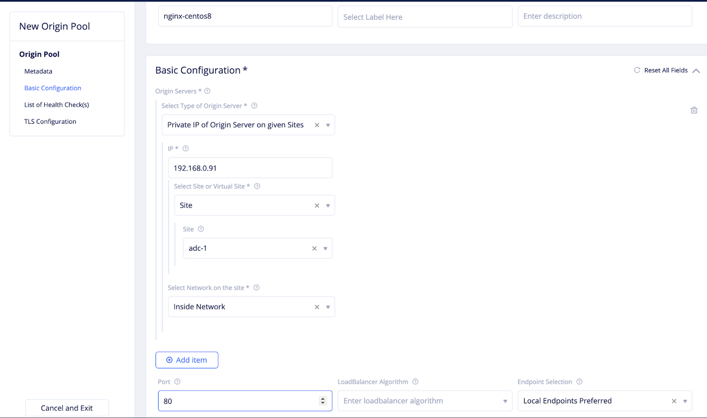

# Application Delivery Controller

VoltMesh単体で仮想マシンや既存Kubernetes ClusterにWAFやAPIゲートウェイの機能を提供します。Internet上のVoltMeshを利用しても良いですし、ローカルでの利用も可能です。
[4.Ingress Gateway](4_ingress_gateway.md)の設定と機能の差分はなく、Origin poolでのEndpointの指定のみが異なります。

ESXiやKVM上にNginxでWebSiteをたちあげ、VoltMeshのInsideインターフェイスからインターネット経由でサービスを公開します。
構成はOutsideのみのワンアームまたは、Outside/Insideのルーティングが可能です、
** ESXi にVolterra Nodeをインストールする際、OVAファイルで一度立ち上げたあと、NICを追加して MultiNIC構成にしてください。

## Origin poolの作成

VoltMesh経由で通信したいVMのIPアドレスをOrigin-poolに登録します。
Select Type of Orivin Serverで`Private IP of Origin Server on given Stes`を選択します。
実際のNginxサーバのIPアドレスを入力し、Volterra Nodeを選択します。ネットワークはInside NetworkまたはOutside Networkを選択します。(MultiNICの場合はInside,Single NICの場合はOutside)
> Add itemで複数サーバを追加できます。

## HTTP load balancerの設定

Manage -> HTTP Load Balancers で “Add HTTP load balancer”を選択します。

NameはLoad Balancer名を入力します。(nginx-ingressなどを)
Basic Configurationの”Domains”はhttp header のHostnameを入力します。
Select Type of Load Balancerは”HTTP”を指定します。
Default Route Origin Poolsは作成したPoolを指定します。

- Name: `nginx-adc`
- Domains: `dummy.localhost` (設定するとDNS infoにVolterraからdomain名が払い出されます。設定後に払い出されたドメイン名を設定してください。)
- Select Type of Load Balancer: `HTTP`
- Default Route Origin Pools: `namespace/nginx-endpoint` (上記で作成したOrigin pool)

## 確認

設定するとDNS infoにVolterraからdomain名が払い出されます。任意のDNSサーバのCNAMEレコードに設定してください。
ドメインにアクセスするとNginxのWebUIが表示されます。
> ドメイン名やDNSサーバにアクセスできない場合、払い出されたDNSをHTTP load Balancerのドメイン名に設定すると、Webブラウザなどでアクセスできます。
