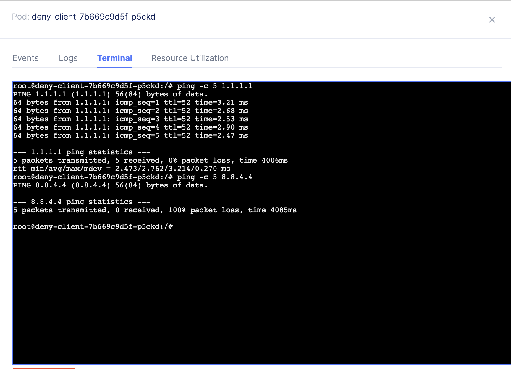
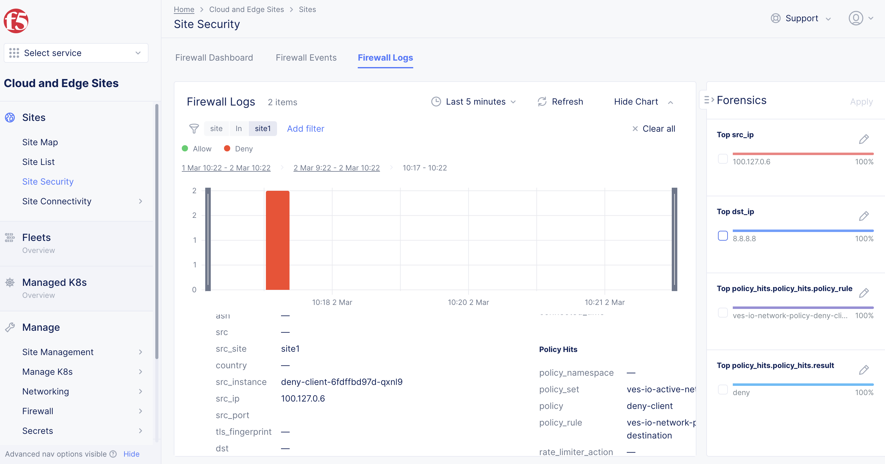
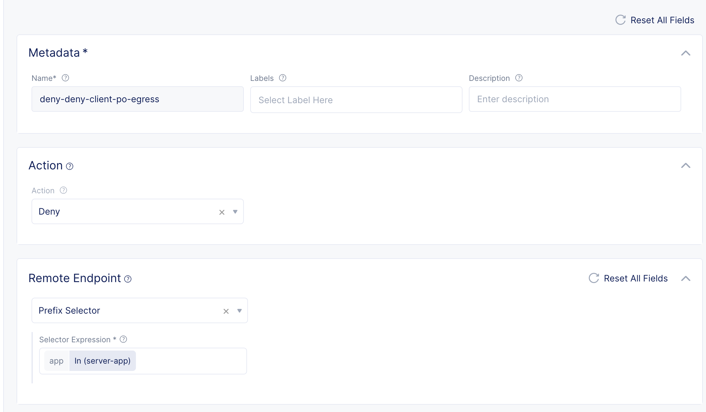
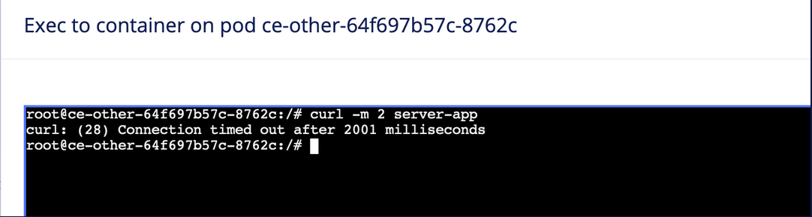

# Network policy

Network PolicyはL3-L4のIngress/Egressのセキュリティを提供します。
Remote EndpointからLocal Endpointに入ってくるトラフィックをIngress、Local EndpintからRemote Endpointに出ていくトラフィックをEgressとなります。
例えば以下の場合、Remote Endpointは(8.8.8.8/32, 8.8.4.4/32)となり、Local Endpointは app:webが設定されたPodとなります。


以下の場合、Remote Endpointはapp:dbが設定されたPodとなり、Local Endpointは app:webが設定されたPodとなります。


## Network policyの構造

コンフィグNetrowk Policy RuleでRemote endpointの条件を作成し、Network PolicyでLocal Endpointに対してNetwork Policy Ruleを適用します。Network Policy SetでNetwork Policy RuleをNamespaceに対して適用します。


## Network Policy

### インターネットへの通信制御

namespace:`security`を作成し、vk8sにVirutal siteを設定します。
Name: `pref-tokyo`
Site type: `CE`
Site Selecter Expression: `pref:tokyo`

- Freeユーザーの場合は既存のNamespaceを先に削除してから作成してください。

shared namespaceで known keyを作成します。(Option)

Label key: `app`

label value:

- `allow-client`
- `deny-client`
- `server-app`


ラベルが異なる2つのPod, app:allow-clientとapp:deny-clientを作成します。

deny-client

```kind: Deployment
apiVersion: apps/v1
metadata:
  name: deny-client
  annotations:
    ves.io/virtual-sites: security/pref-tokyo
spec:
  replicas: 1
  selector:
    matchLabels:
      app: deny-client
  template:
    metadata:
      labels:
        app: deny-client
    spec:
      containers:
        - name: deny-client
          image: dnakajima/netutils:1.3
```

```kind: Deployment
apiVersion: apps/v1
metadata:
  name: allow-client
  annotations:
    ves.io/virtual-sites: security/pref-tokyo
spec:
  replicas: 1
  selector:
    matchLabels:
      app: allow-client
  template:
    metadata:
      labels:
        app: allow-client
    spec:
      containers:
        - name: allow-client
          image: dnakajima/netutils:1.3
```

作成したPod, app:deny-clientのにGoogle-DNSへのアクセスを拒否します。


Deny client用のNetwork Policyを作成し、Ingress RulesとEgress Rulesを作成します。

- deny-client-po
  - Local Endpoint: Label Selector
  - Selector Expression: app:in(deny-client)

- Ingress Rules:
  - allow-deny-client-po-ingress
- Egress Rules:
  - deny-deny-client-po-egress
  - allow-deny-client-po-egress

ルールは`Add network policy rule`から作成します。


Ingress Rules

- allow-deny-client-po-ingress
    Action: Allow

    (** 暗黙のDenyがあるため、設定しないとすべての通信が拒否される）

Egress Rules

- deny-deny-client-po-egress
    Action: Deny

    Remote Endpoint: IP Prefix: Prefix [8.8.8.8/32, 8.8.4.4/32]

- allow-deny-client-po-egress
    Action: Allow

 Allow client用のNetwork Policyを作成し、Ingress RulesとEgress Rulesを作成します。

- allow-client-po
  - Local Endpoint: Prefix

- Ingress Rules:
  - allow-allow-client-po-ingress
- Egress Rules:
  - allow-allow-client-po-egress

Ingress Rules

- allow-allow-client-po-ingress
    Action: Allow

Egress Rules

- allow-allow-client-po-egress
    Action: Allow

Network Policy Setを作成します。

- po-set1
  - Policies: Select policy: [1: deny-client-po, 2: allow-client-po]


フィルターの確認はPodから行えます。Virtual K8sの Pods から対象のPodに Exec to Containerより接続できます。



選択後、Container to exec toから deny-clientやallow-clientを選択し、Command to executeにbashを入れるとコンテナにbashで接続できます。

- kubeconfigをダウンロードし、kubectlで接続することも可能です。



deny-clientはgoogle-dnsのポリシーがかかっているため8.8.8.8にはpingできませんが、allow-clientはpingできることが確認できます。


### 同一Kubernetes Clouster内での通信制御

server-appを追加で作成します。
app:deny-client からのみapp:server-appへの通信を許可し、 app:ce-otherは拒否します


app:webのPodとServiceを作成します。

```kind: Deployment
apiVersion: apps/v1
metadata:
  name: server-app
  annotations:
    ves.io/virtual-sites: security/pref-tokyo
spec:
  replicas: 1
  selector:
    matchLabels:
      app: server-app
  template:
    metadata:
      labels:
        app: server-app
    spec:
      containers:
        - name: server-app
          image: dnakajima/inbound-app:1.0
          ports:
            - containerPort: 8080
              protocol: TCP
```

```kind: Service
apiVersion: v1
metadata:
  name: server-app
  labels:
    app: server-app
  annotations:
    ves.io/virtual-sites: security/security/pref-tokyo
spec:
  ports:
    - protocol: TCP
      port: 80
      targetPort: 8080
  selector:
    app: server-app
  type: ClusterIP
```

Deny client用のNetwork Policyを作成し、Ingress RulesとEgress Rulesを作成します。

- deny-client-po
  - Local Endpoint: Label Selector
  - Selector Expression: app:in(deny-client)

- Ingress Rules:
  - allow-deny-client-po-ingress
- Egress Rules:
  - deny-deny-client-po-egress
  - allow-deny-client-po-egress

ルールは`Add network policy rule`から作成します。



Ingress Rules

- allow-deny-client-po-ingress
    Action: Allow

    (** 暗黙のDenyがあるため、設定しないとすべての通信が拒否される）

Egress Rules

- deny-deny-client-po-egress
    Action: Deny

    Remote Endpoint: Label Selector
  - Selector Expression: app:in(server-app)

- allow-deny-client-po-egress
    Action: Allow

 Allow client用のNetwork Policyを作成し、Ingress RulesとEgress Rulesを作成します。

- allow-client-po
  - Local Endpoint: Prefix

- Ingress Rules:
  - allow-allow-client-po-ingress
- Egress Rules:
  - allow-allow-client-po-egress

Ingress Rules

- allow-allow-client-po-ingress
    Action: Allow

Egress Rules

- allow-allow-client-po-egress
    Action: Allow

Network Policy Setを作成します。

- po-set1
  - Policies: Select policy: [1: deny-client-po, 2: allow-client-po]

deny-clientはのポリシーがかかっているためserver-appにはcurlできませんが、allow-clientはcurlできることが確認できます。



