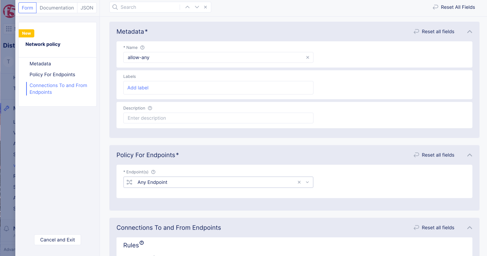
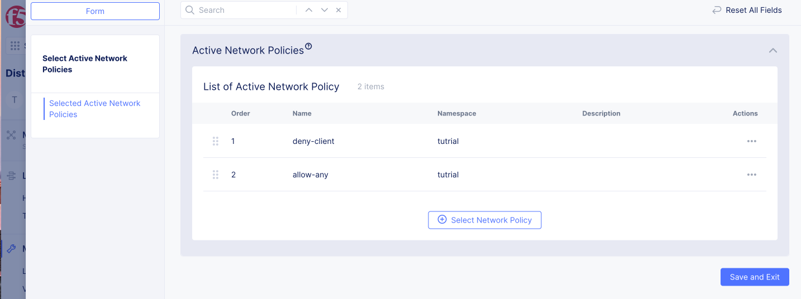

# Network policy

Network PolicyはL3-L4のIngress/Egressのセキュリティを提供します。
Endpointに入ってくるトラフィックをIngress Ruleで設定し、Endpointから出ていくトラフィックをEgress Ruleで設定します。
このポリシーはステートフルに動作するため、Egress Ruleで許可したトラフィックの戻り通信をIngress Ruleで設定する必要はありません。


同一Namespace内の通信も同様で、Endpointに入ってくるトラフィックをIngress Ruleで設定し、Endpointから出ていくトラフィックをEgress Ruleで設定します。


## Network policyの構造

コンフィグは`Netrowk Policy` でIngress/Egressの条件を作成し、`Active Network Policies`でNetwork Policy RuleをNamespaceに対して適用します。


## Network Policy

### インターネットへの通信制御

namespace:`security`を作成し、vk8sにVirutal siteを設定します。
Name: `pref-tokyo`
Site type: `CE`
Site Selecter Expression: `pref:tokyo`

- Freeユーザーの場合は既存のNamespaceを先に削除してから作成してください。

Shared Configurationで known keyを作成します。

- Freeユーザーの場合は既存のKnown labelの `pref:osaka` を先に削除してから作成してください。

Label key: `app`

label value:

- `allow-client`
- `deny-client`
- `server-app`


ラベルが異なる2つのPod, app:allow-clientとapp:deny-clientを作成します。

deny-client

```
apiVersion: apps/v1
kind: Deployment
metadata:
  name: deny-client
  annotations:
    ves.io/virtual-sites: security/pref-tokyo
spec:
  replicas: 1
  selector:
    matchLabels:
      app: deny-client
  template:
    metadata:
      labels:
        app: deny-client
    spec:
      containers:
        - name: deny-client
          image: dnakajima/netutils:1.3
```

allow-client

```
apiVersion: apps/v1
kind: Deployment
metadata:
  name: allow-client
  annotations:
    ves.io/virtual-sites: security/pref-tokyo
spec:
  replicas: 1
  selector:
    matchLabels:
      app: allow-client
  template:
    metadata:
      labels:
        app: allow-client
    spec:
      containers:
        - name: allow-client
          image: dnakajima/netutils:1.3
```

作成したPod, deny-clientのにGoogle-DNSへのアクセスを拒否します。
作成手順は以下となります。
1. すべてを許可するルールの作成
2. Google-DNSを拒否するルールの作成
3. ルールの適用


Network Policyは `Manage` -> `vK8s Network Policies` -> `Network Policies`で作成します。


1. 暗黙のDenyがあるため、全てを許可するポリシーを作成します。

ルールは`Add network policy`から作成します。

- name: `allow-any`
  - Policy For Endpoints
    - Endpint(s): `Any Endpoints`
  - Ingress Rules
    - Name: `allow-any-ingress`
    - Action: `Allow`
    - Select Other Endpoint: `Any Endpoint`
    - Select Type of Traffic to Match: `Match All Traffic`
  - Egress Rules:
    - Name: `allow-any-egress`
    - Action: `Allow`
    - Select Other Endpoint: `Any Endpoint`
    - Select Type of Traffic to Match: `Match All Traffic`




2. `deny-client`からのGoogle-DNSへの通信を拒否するルールを作成します。

- name: `deny-client`
  - Policy For Endpoints
    - Endpint(s): `Label Selector`
      - Selector Expression: `app:in (deny-client)`
  - Ingress Rules
    - Name: `allow-any-ingress`
    - Action: `Allow`
    - Select Other Endpoint: `Any Endpoint`
    - Select Type of Traffic to Match: `Match All Traffic`
  - Egress Rules: (Rule-1)
    - Name: `deny-destination`
    - Action: `Deny`
    - Logging Action: `Log` # Show Advanced Fieldsを有効にすると表示されます。Logを有効にすると Site Security でログが表示されます。
    - Select Other Endpoint: `IPv4 Prefix List`
      - IPv4 Prefix List: `8.8.4.4/32`, `8.8.8.8/32`
    - Select Type of Traffic to Match: `Match All Traffic`
  - Egress Rules: (Rule-2)
    - Name: `allow-others`
    - Action: `Allow`
    - Logging Action: `Do Not Log`
    - Select Other Endpoint: `Any Endpoint`
    - Select Type of Traffic to Match: `Match All Traffic`

3. 作成したルールを適用します。

`Manage` -> `vK8s Network Policies` -> `Active Network Policies` から作成したポリシーを選択し、適用します。1から順番にポリシーが評価されるため、個別のポリシー設定が若番に来るように設定します。

  -  Active Network Policies: [1: deny-client, 2: allow-client]



フィルターの確認はPodから行えます。Virtual K8sの Pods から対象のPodに Exec to Containerより接続できます。


選択後、Container to exec toから deny-clientやallow-clientを選択し、Command to executeにbashを入れるとコンテナにbashで接続できます。

- kubeconfigをダウンロードし、kubectlで接続することも可能です。

deny-clientはgoogle-dnsのポリシーがかかっているため8.8.8.8にはpingできませんが、allow-clientはpingできることが確認できます。


System -> Site Securityよりフィルターにヒットしたログを確認できます。
ログには送信元のPod名や送信先のIPアドレスやプロトコル、ヒットしたポリシーなどが表示されます。


### 同一Kubernetes Clouster内での通信制御

server-appを追加で作成します。Shared namespaceのApp labelにも`server-app`をKeyとして追加してください。

ここではapp:allow-client からのみapp:server-appへの通信を許可し、 app:deny-clientからの通信は拒否します
Freeでは3つ以上のDeplyomentが作成できないため、これ以降は Individual以上のテナント契約が必要です。


app:webのPodとServiceを作成します。

```
apiVersion: apps/v1
kind: Deployment
metadata:
  name: server-app
  annotations:
    ves.io/virtual-sites: security/pref-tokyo
spec:
  replicas: 1
  selector:
    matchLabels:
      app: server-app
  template:
    metadata:
      labels:
        app: server-app
    spec:
      containers:
        - name: server-app
          image: dnakajima/inbound-app:1.0
          ports:
            - containerPort: 8080
              protocol: TCP
```

```
apiVersion: v1
kind: Service
metadata:
  name: server-app
  labels:
    app: server-app
  annotations:
    ves.io/virtual-sites: security/pref-tokyo
spec:
  ports:
    - protocol: TCP
      port: 80
      targetPort: 8080
  selector:
    app: server-app
  type: ClusterIP
```

1. 暗黙のDenyがあるため、全てを許可するポリシーを作成します。

ルールは`Add network policy`から作成します。

- name: `allow-any`
  - Policy For Endpoints
    - Endpint(s): `Any Endpoints`
  - Ingress Rules
    - Name: `allow-any-ingress`
    - Action: `Allow`
    - Select Other Endpoint: `Any Endpoint`
    - Select Type of Traffic to Match: `Match All Traffic`
  - Egress Rules:
    - Name: `allow-any-egress`
    - Action: `Allow`
    - Select Other Endpoint: `Any Endpoint`
    - Select Type of Traffic to Match: `Match All Traffic`

2. deny-client用のルールを作成します。

- name: `deny-client`
  - Policy For Endpoints
    - Endpint(s): `Label Selector`
      - Selector Expression: `app:in (deny-client)`
  - Ingress Rules
    - Name: `allow-any-ingress`
    - Action: `Allow`
    - Select Other Endpoint: `Any Endpoint`
    - Select Type of Traffic to Match: `Match All Traffic`
  - Egress Rules: (Rule-1)
    - Name: `deny-destination`
    - Action: `Deny`
    - Logging Action: `Log` # Show Advanced Fieldsを有効にすると表示されます。Logを有効にすると Site Security でログが表示されます。
    - Select Other Endpoint: `Label Selector`
      -  Selector Expression: `app:in (server-app)`
    - Select Type of Traffic to Match: `Match All Traffic`
  - Egress Rules: (Rule-2)
    - Name: `allow-others`
    - Action: `Allow`
    - Logging Action: `Do Not Log`
    - Select Other Endpoint: `Any Endpoint`
    - Select Type of Traffic to Match: `Match All Traffic`


Deny client用のNetwork Policyを作成し、Ingress RulesとEgress Rulesを作成します。

3. 作成したルールを適用します。

Active Network Policies から作成したポリシーを選択し、適用します。1から順番にポリシーが評価されるため、個別のポリシー設定が若番に来るように設定します。

  -  Active Network Policies: [1: deny-client, 2: allow-client]

deny-clientはのポリシーがかかっているためserver-appにはcurlできませんが、allow-clientはcurlできることが確認できます。


