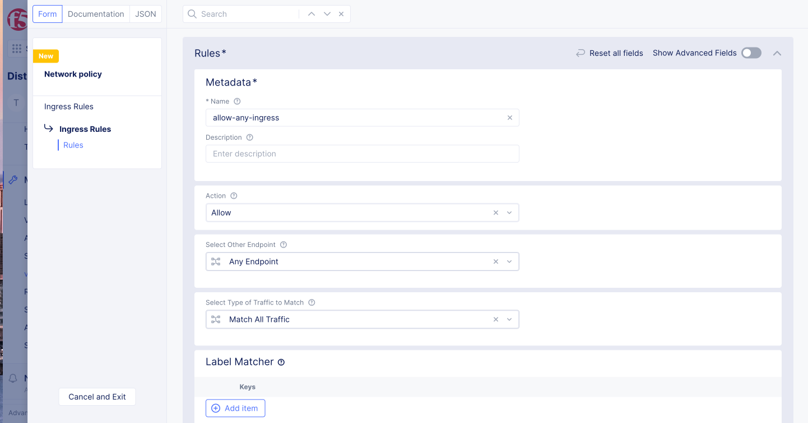

# Network policy

Network PolicyはL3-L4のIngress/Egressのセキュリティを提供します。
Remote EndpointからLocal Endpointに入ってくるトラフィックをIngress、Local EndpintからRemote Endpointに出ていくトラフィックをEgressとなります。
例えば以下の場合、Remote Endpointは(8.8.8.8/32, 8.8.4.4/32)となり、Local Endpointは app:webが設定されたPodとなります。


以下の場合、Remote Endpointはapp:dbが設定されたPodとなり、Local Endpointは app:webが設定されたPodとなります。


## Network policyの構造

コンフィグNetrowk Policy RuleでRemote endpointの条件を作成し、Network PolicyでLocal Endpointに対してNetwork Policy Ruleを適用します。Network Policy SetでNetwork Policy RuleをNamespaceに対して適用します。


## Network Policy

### インターネットへの通信制御

namespaceは`seurity`とし、virtual-siteは`vsite-adc`を作成します。
ラベルが異なる2つのPod, app:allow-serverとapp:deny-serverを作成します。
ラベルが異なる2つのPod, app:ce-clientとapp:ce-otherを作成します。

ce-client

```kind: Deployment
apiVersion: apps/v1
metadata:
  name: ce-client
  namespace: security
  annotations:
    ves.io/virtual-sites: security/vsite-adc
spec:
  replicas: 1
  selector:
    matchLabels:
      app: ce-client
  template:
    metadata:
      labels:
        app: ce-client
    spec:
      containers:
        - name: ce-client
          image: dnakajima/netutils:1.3
```

```kind: Deployment
apiVersion: apps/v1
metadata:
  name: ce-other
  namespace: security
  annotations:
    ves.io/virtual-sites: security/vsite-adc
spec:
  replicas: 1
  selector:
    matchLabels:
      app: ce-other
  template:
    metadata:
      labels:
        app: ce-other
    spec:
      containers:
        - name: ce-other
          image: dnakajima/netutils:1.3
```

Network policyで使用するラベルは、2020/8/24時点でShared namespaceのknown labelsとknown keysに設定されているか、ves.io/app ラベルを使用する必要があります。


作成したPod, app:ce-clientのにGoogle-DNSへのアクセスを拒否します


Network Policy Ruleを2つ作成します。

- allow-any
    Action: Allow

    (** 暗黙のDenyがあるため、設定しないとすべての通信が拒否される）
- deny-google-dns
    Action: Deny

    Remote Endpoint: IP Prefix: Prefix [8.8.8.8/32, 8.8.4.4/32]



Network Policy を2つ作成します。

- ce-client-po
  - Local Endpoint: Label Selector, Selector
  - Expression: app:in(ce-client)
  - Ingress Rules: 1:allow-any
  - Egress Rules:  1: deny-google-dns, 2: allow-any

- ce-other-po
  - Ingress Rules: 1:allow-any
  - Egress Rules: 1:allow-any


Network Policy Setを作成します。

- po-set1
  - Policies: Select policy: [1: ce-client-po, 2: ce-others-po]


フィルターの確認はPodから行えます。Virtual K8sの Pods から対象のPodに Exec to Containerより接続できます。


選択後、Container to exec toから ce-clientやce-otherを選択し、Command to executeにbashを入れるとコンテナにbashで接続できます。

- kubeconfigをダウンロードし、kubectlで接続することも可能です。


ce-clientはgoogle-dnsのポリシーがかかっているため8.8.8.8にはpingできませんが、ce-otherはpingできることが確認できます。


### 同一Kubernetes Clouster内での通信制御

namespaceは`seurity`とし、virtual-siteは`vsite-adc`を作成します。
ラベルが異なる2つのPod, app:allow-serverとapp:deny-serverを作成します。
app:ce-client からのみapp:server-appへの通信を許可し、 app:ce-otherは拒否します


app:webのPodとServiceを作成します。

```kind: Deployment
apiVersion: apps/v1
metadata:
  name: server-app
  namespace: security
  annotations:
    ves.io/virtual-sites: security/vsite-adc
spec:
  replicas: 1
  selector:
    matchLabels:
      app: server-app
  template:
    metadata:
      labels:
        app: server-app
    spec:
      containers:
        - name: server-app
          image: dnakajima/inbound-app:1.0
          ports:
            - containerPort: 8080
              protocol: TCP
```

```kind: Service
apiVersion: v1
metadata:
  name: web
  namespace: security
  labels:
    app: server-app
  annotations:
    ves.io/virtual-sites: security/vsite-adc
spec:
  ports:
    - protocol: TCP
      port: 80
      targetPort: 8080
  selector:
    app: server-app
  type: ClusterIP
```

Network Policy Ruleを1つ作成します。

- deny-server-app

  - Action: Deny
  - Remote Endpoint: Prefix Selector
  - Selection Expression: app:in(server-app)


Network Policy を1つ作成します。

- remote-app-ce-other
  - Local Endpoint: Label Selector
  - Selector Expression: app:in(ce-other)
  - Ingress Rules: 1:allow-any
  - Egress Rules:  1: deny-server-dns, 2: allow-any


Network Policy SetにNetwork Policyを追加します

- po-set1
  - Policies: Select policy: [1: ce-client-po
  - 2:remote-app-ce-other, 3: ce-others-po]


ce-otherはremote-app-ce-otherのポリシーがかかっているためserver-appにはcurlできませんが、ce-clientはcurlできることが確認できます。


