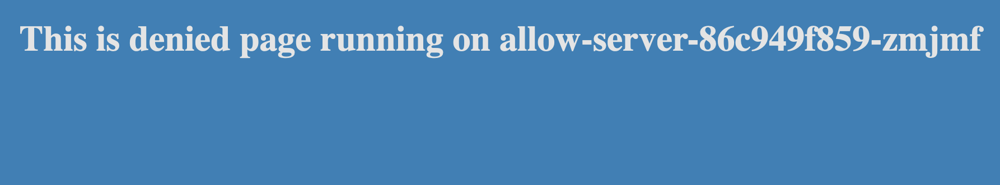
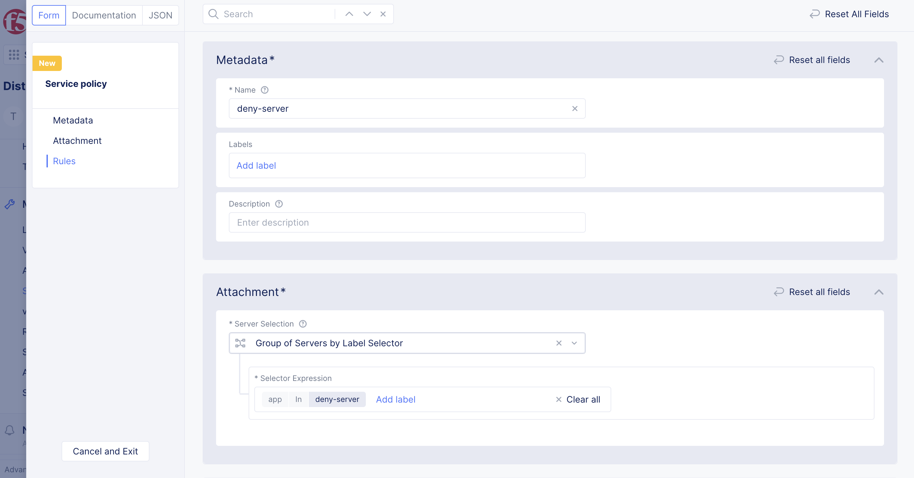

# Service Policy (Ingress Gateway)

Ingress GatewayはHTTP ベースのセキュリティを提供します。
外部からVolterra Nodeに入ってくるトラフィックをClient、Kubernetes ServiceをServerとなります。
例えば以下の場合、外部ネットワーク(Any)となり、Kubernetes Serviceは app:webが設定されたServiceとなります。


以下の場合、Clientはapp:webが設定されたPodとなり、Serverは app:DBが設定されたServiceとなります。


## Service policyの構造

Service Policy RuleでClinetの条件を作成し、Service PolicyでServerに対してService Policy Ruleを適用します。Service Policy SetでService Policy RuleをNamespaceに対して適用します。


## Service Policy

2つのサービスを作成し、外部からdeny-serverをもつサービス(HTTP loadbalancer)は url/deny/のPathへのアクセスを拒否します。

### インターネットからの通信制御

2つのサービスを作成し、外部からdeny-serverをもつサービス(HTTP loadbalancer)は url/deny/のPathへのアクセスを拒否します。


#### Kubenretesの設定

shared namespaceで known keyを作成します。

Label key: `app`

label value:

- `allow-server`
- `deny-server`

namespaceは`seurity`とし、virtual-siteは`pref-tokyo`を作成します。
ラベルが異なる2つのPod, app:allow-serverとapp:deny-serverを作成します。

allow-server

```kind: Deployment
apiVersion: apps/v1
metadata:
  name: allow-server
  annotations:
    ves.io/virtual-sites: security/pref-tokyo
spec:
  replicas: 1
  selector:
    matchLabels:
      app: allow-server
  template:
    metadata:
      labels:
        app: allow-server
    spec:
      containers:
        - name: allow-server
          image: dnakajima/inbound-app:2.0
```

deny-server

```kind: Deployment
apiVersion: apps/v1
metadata:
  name: deny-server
  annotations:
    ves.io/virtual-sites: security/pref-tokyo
spec:
  replicas: 1
  selector:
    matchLabels:
      app: deny-server
  template:
    metadata:
      labels:
        app: deny-server
    spec:
      containers:
        - name: deny-server
          image: dnakajima/inbound-app:2.0
```

作成したPodに対応する2つのservice, を作成します。

allow-server

```kind: Service
apiVersion: v1
metadata:
  name: allow-server
  annotations:
    ves.io/virtual-sites: security/pref-tokyo
spec:
  ports:
    - protocol: TCP
      port: 80
      targetPort: 8080
  selector:
    app: allow-server
  type: ClusterIP
```

deny-server

```kind: Service
apiVersion: v1
metadata:
  name: deny-server
  annotations:
    ves.io/virtual-sites: security/pref-tokyo
spec:
  ports:
    - protocol: TCP
      port: 80
      targetPort: 8080
  selector:
    app: deny-server
  type: ClusterIP
```

#### Origin pool の設定

作成したServiceを外部からアクセスできるようにIngress Gatewayを設定します。作成した2つの ServiceをOrigin poolとして登録します。 Manage -> Origin Pools で “Add Origin Pool”を選択します。

- Origin server
  - Name: `allow-server`
  - Basic Configuration:
    - Select Type of Origin Server: `k8sService - Name of Origin Ser...`
    - Service Name: `allow-server.security` (”Kubernetes service名 . namespace”)
    - Select Site or Virtual Site: `Virtual Site`
    - Virtual Site: `pref-tokyo`。
    - Select Network on the Site: `Vk8s Networks on Site`
  - Port: `80`


- Origin server
  - Name: `deny-server`
  - Basic Configuration:
    - Select Type of Origin Server: `k8sService - Name of Origin Ser...`
    - Service Name: `deny-server.security` (”Kubernetes service名 . namespace”)
    - Select Site or Virtual Site: `Virtual Site`
    - Virtual Site: `pref-tokyo`。
    - Select Network on the Site: `Vk8s Networks on Site`
  - Port: `80`

#### HTTP Load Balancerの設定

Manage -> HTTP Load Balancers で “Add HTTP load balancer”を選択します。

- Name: `allow-server-lb`
- Domains: `dummy.localhost` (設定するとDNS infoにVolterraからdomain名が払い出されます。設定後に払い出されたドメイン名を設定してください。)
- Select Type of Load Balancer: `HTTP`
- Default Route Origin Pools: `namespace/nginx-endpoint` (上記で作成したOrigin pool)

設定するとDNS infoにVolterraからdomain名が払い出されます。作成したロードバランサーのDomainsに設定するか、任意のDNSサーバのCNAMEレコードに設定してください。
外部から設定したドメインにアクセスするとNginxのWebUIが表示されます。

同様にDeny server用のロードバランサーも作成します。

- Name: `deny-server-lb`
- Domains: `dummy.localhost` (設定するとDNS infoにVolterraからdomain名が払い出されます。設定後に払い出されたドメイン名を設定してください。)
- Select Type of Load Balancer: `HTTP`
- Default Route Origin Pools: `namespace/nginx-endpoint` (上記で作成したOrigin pool)

#### サービスへの接続確認

作成したサービスにアクセスできることを確認します。
<http://url/> , <http://url/allow/> , <http://url/deny> にアクセスできることを確認します。




#### Service policyの作成

Service Policy を2つ作成します。




deny-server

- deny-server
  - Server Selection: `Group of Servers by Label Selector`
    - Selector Expression: `app:in(deny-server)`
  - Rules: `deny-deny-server`, `allow-deny-server`

Rules

- deny-deny-server
  - Action: `Deny`
  - HTTP Path: `Prefix Values : /deny`

- allow-deny-server
  - Action: `Allow`

allow-server

- allow-server
  - Server Selection: `Any Server`
  - Select rule: `allow-allow-server`

Service Policy SetにService Policyを追加します


- service-policy-set1
  - Policies: Select policy: `[1: deny-server, 2:allow-server]`

#### 設定の確認

作成したサービスにアクセスできることを確認します。
deny-web-serverの<http://url/>,<http://url/allow/> は正常に表示されますが、<http://url/deny>は403エラーが返るのを確認します。


作成したサービスにアクセスできることを確認します。
allow-web-serverの<http://url/>,<http://url/allow/> ,<http://url/deny>,  はアクセスが可能です。
