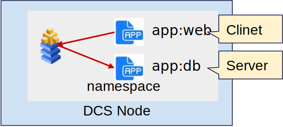
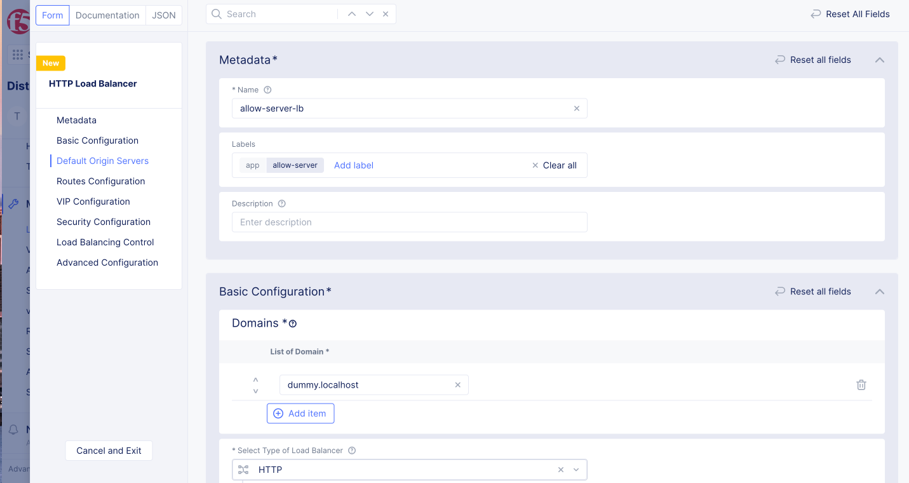
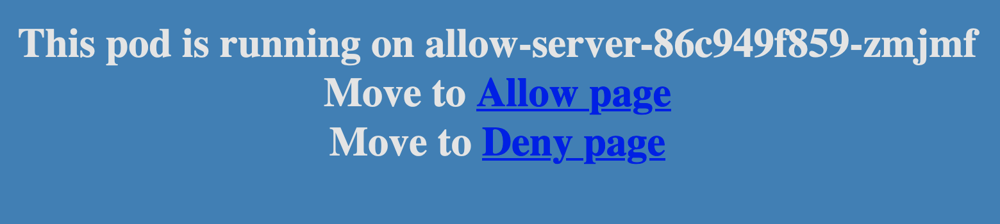
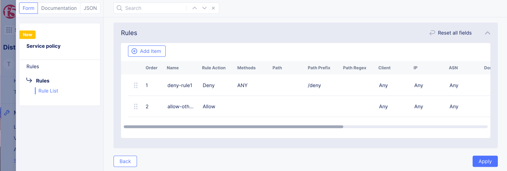
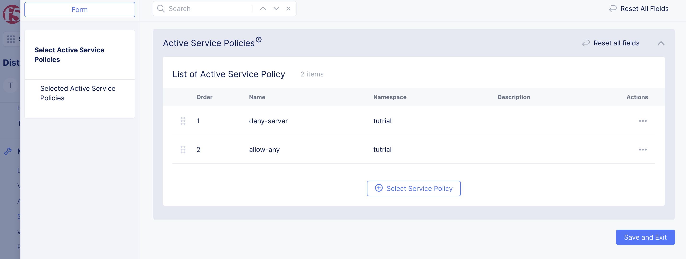

# Service Policy (Ingress Gateway)

Ingress GatewayはHTTP ベースのセキュリティを提供します。
外部からDCS Nodeに入ってくるトラフィックをClient、Kubernetes ServiceがServerとなります。
例えば以下の場合、外部ネットワーク(Any)となり、Kubernetes Serviceは app:webが設定されたServiceとなります。


以下の場合、Clientはapp:webが設定されたPodとなり、Serverは app:DBが設定されたServiceとなります。



## Service policyの構造

Service Policy RuleでClinetの条件を作成し、Service PolicyでServerに対してService Policy Ruleを適用します。Service Policy SetでService Policy RuleをNamespaceに対して適用します。


## Service Policy

2つのサービスを作成し、外部からdeny-serverをもつサービス(HTTP loadbalancer)は url/deny/のPathへのアクセスを拒否します。

### インターネットからの通信制御

2つのサービスを作成し、外部からdeny-serverをもつサービス(HTTP loadbalancer)は url/deny/のPathへのアクセスを拒否します。


#### Kubenretesの設定

Shared Configurationで known keyを作成します。
Free テナントの場合、既存のLabelを削除してから作成してください。

Label key: `app`

Label value:

- `allow-server`
- `deny-server`

namespaceは`seurity`とし、virtual-siteは`pref-tokyo`を作成します。
ラベルが異なる2つのPod, app:allow-serverとapp:deny-serverを作成します。

allow-server

```
apiVersion: apps/v1
kind: Deployment
metadata:
  name: allow-server
  annotations:
    ves.io/virtual-sites: security/pref-tokyo
spec:
  replicas: 1
  selector:
    matchLabels:
      app: allow-server
  template:
    metadata:
      labels:
        app: allow-server
    spec:
      containers:
        - name: allow-server
          image: dnakajima/inbound-app:3.0
```

deny-server

```
apiVersion: apps/v1
kind: Deployment
metadata:
  name: deny-server
  annotations:
    ves.io/virtual-sites: security/pref-tokyo
spec:
  replicas: 1
  selector:
    matchLabels:
      app: deny-server
  template:
    metadata:
      labels:
        app: deny-server
    spec:
      containers:
        - name: deny-server
          image: dnakajima/inbound-app:3.0
```

作成したPodに対応する2つのservice, を作成します。

allow-server

```
apiVersion: v1
kind: Service
metadata:
  name: allow-server
  annotations:
    ves.io/virtual-sites: security/pref-tokyo
spec:
  ports:
    - protocol: TCP
      port: 80
      targetPort: 8080
  selector:
    app: allow-server
  type: ClusterIP
```

deny-server

```
apiVersion: v1
kind: Service
metadata:
  name: deny-server
  annotations:
    ves.io/virtual-sites: security/pref-tokyo
  labels:
    app: deny-server
spec:
  ports:
    - protocol: TCP
      port: 80
      targetPort: 8080
  selector:
    app: deny-server
  type: ClusterIP
```

#### Origin pool の設定

作成したServiceを外部からアクセスできるようにIngress Gatewayを設定します。作成した2つの ServiceをOrigin poolとして登録します。 Manage -> Origin Pools で “Add Origin Pool”を選択します。

<b>Allow-server</b>

- Name: `allow-server`
- Origin Servers:
  - Select Type of Origin Server: `k8s Service Name of Origin Server on given Sites.`
  - Service Name: `allow-server.security` (”Kubernetes service名 . namespace”)
  - Select Site or Virtual Site: `Virtual Site`
  - Virtual Site: `pref-tokyo`。
  - Select Network on the Site: `Vk8s Networks on Site`
- Port: `80`

<b>Deny-server</b>

- Name: `deny-server`
- Origin Servers:
  - Select Type of Origin Server: `k8s Service Name of Origin Server on given Sites.`
  - Service Name: `deny-server.security` (”Kubernetes service名 . namespace”)
  - Select Site or Virtual Site: `Virtual Site`
  - Virtual Site: `pref-tokyo`。
  - Select Network on the Site: `Vk8s Networks on Site`
- Port: `80`

#### HTTP Load Balancerの設定

Load BalancerにService PolicyでのLabelセレクトはHTTP/TCP Load BalancerのLabelsのラベルで行います。
Manage -> HTTP Load Balancers で “Add HTTP load balancer”を選択します。

- Name: `allow-server-lb`
- Labels: `app: allow-server`
- Domains: `dummy.localhost` (設定するとDNS infoにDCSからdomain名が払い出されます。設定後に払い出されたドメイン名を設定してください。)
- Select Type of Load Balancer: `HTTP`
- Default Route Origin Pools: `security/allow-server` (上記で作成したOrigin pool)

設定するとDNS infoにDCSからdomain名が払い出されます。作成したロードバランサーのDomainsに設定するか、任意のDNSサーバのCNAMEレコードに設定してください。
外部から設定したドメインにアクセスするとNginxのWebUIが表示されます。



同様にDeny server用のロードバランサーも作成します。

- Name: `deny-server-lb`
- Labels: `app: deny-server`
- Domains: `dummy.localhost` (設定するとDNS infoにDCSからdomain名が払い出されます。設定後に払い出されたドメイン名を設定してください。)
- Select Type of Load Balancer: `HTTP`
- Default Route Origin Pools: `security/deny-server` (上記で作成したOrigin pool)

#### サービスへの接続確認

作成したサービスにアクセスできることを確認します。
<http://url/> , <http://url/allow/> , <http://url/deny> にアクセスできることを確認します。




#### Service policyの作成

Service Policyは `Manage` -> `Servive Policies` -> `Service Policy`で作成します。

作成したdeny-serverの`/deny`へのアクセスを拒否します。
作成手順は以下となります。
1. 全てのサービスを許可するルールの作成
2. deny-serverの`/deny`を拒否するルールの作成
3. ルールの適用

<b>1.全てのサービスを許可するルールの作成</b>

暗黙のDenyがあるため、全てを許可するポリシーを作成します

- name: `allow-any`
  - Server Selection: `Any Server`
  - Select Policy Rules: `Allow All Requests`

<b>2. deny-serverの`/deny`を拒否するルールの作成</b>

- name: `deny-server`
  - Server Selection: `Group of Servers by Label Selector`
    - Selector Expression: `app: in (deny-server)`
  - Select Policy Rules: `Custom Rule List`
    - Rules
      - Name: deny-rule1 (Rule1)
        - Rule Specification
          - Action: `Deny`
          - Client Selection: `Any Client`
          - HTTP Method: `ANY`
          - HTTP Path: `Prefix Values : /deny`
      - Name: allow-others (Rule2)
        - Rule Specification
          - Action: `Allow`
          - Client Selection: `Any Client`




<b>3. ルールの適用</b>

Service Policyは `Manage` -> `Servive Policies` -> `Active Service Policies`で Active Service PoliciesにService Policyを追加します

- service-policy-set1
  - Policies: Select policy: `[1: deny-server, 2:allow-server]`



#### 設定の確認

作成したサービスにアクセスできることを確認します。
deny-web-serverの<http://url/>,<http://url/allow/> は正常に表示されますが、<http://url/deny>は403エラーが返るのを確認します。


作成したサービスにアクセスできることを確認します。
allow-web-serverの<http://url/>,<http://url/allow/> ,<http://url/deny>,  はアクセスが可能です。

`Load Balancers` -> `NTTP Load Balancers`よりフィルターにヒットしたログを確認できます。 ログには送信元のPod名や送信先のIPアドレスやプロトコル、ヒットしたポリシーなどが表示されます。


#### Kubernetes ServiceへのService Policy適用

DCSではKubernetesのServiceのタイプが`HTTP_PROXY`, `TCP_PROXY`, `TCP_PROXY_WITH_SNI`の3種類があり、デフォルトは`TCP_PROXY`です。
TCP ProxyではHTTPベースのフィルタはかからないため、Kubernetes ServiceのマニフェストにHTTP_PROXYを有効にするannotation｀ves.io/proxy-type｀を設定します。
Freeアカウントでは`app-client`を建てられないため、allow-serverを削除してからマニフェストを追加してください。

上記で作成したManifestを以下のように変更します。

```
apiVersion: v1
kind: Service
metadata:
  name: deny-server
  annotations:
    ves.io/proxy-type: HTTP_PROXY
    ves.io/virtual-sites: security/pref-tokyo
  labels:
    app: deny-server
spec:
  ports:
    - protocol: TCP
      port: 80
      targetPort: 8080
  selector:
    app: deny-server
  type: ClusterIP
```

また、Serivceに接続するクライアントを立ち上げます。

```
apiVersion: apps/v1
kind: Deployment
metadata:
  name: app-client
  annotations:
    ves.io/virtual-sites: security/pref-tokyo
spec:
  replicas: 1
  selector:
    matchLabels:
      app: app-client
  template:
    metadata:
      labels:
        app: app-client
    spec:
      containers:
        - name: app-client
          image: dnakajima/netutils:1.3
```

app-clientから`curl -v deny-server/deny/`を実行すると403エラーが返ってることが確認できます。


